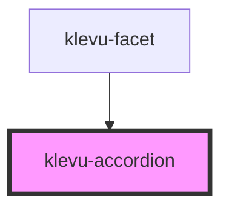

# klevu-accordion

<!-- Auto Generated Below -->

## Properties

| Property    | Attribute    | Description                 | Type                   | Default     |
| ----------- | ------------ | --------------------------- | ---------------------- | ----------- |
| `open`      | `open`       | is accordion open           | `boolean`              | `false`     |
| `startOpen` | `start-open` | Should it initially be open | `boolean \| undefined` | `undefined` |

## Dependencies

### Used by

 - [klevu-facet](../klevu-facet)

### Graph

----------------------------------------------

*Built with [StencilJS](https://stenciljs.com/)*
