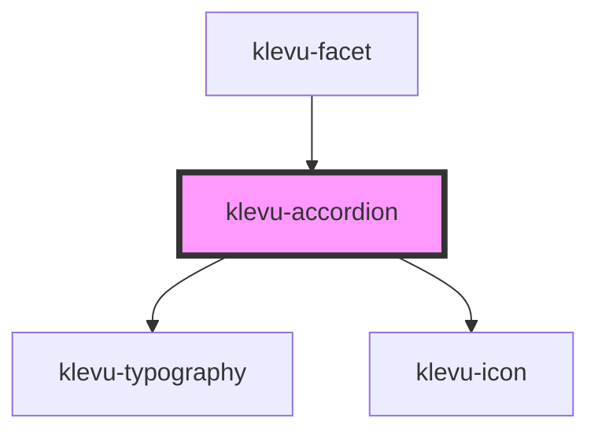

# klevu-accordion

<!-- Auto Generated Below -->

## Overview

Component that wrap two slots to create accordion element.

## Properties

| Property    | Attribute    | Description                 | Type                   | Default     |
| ----------- | ------------ | --------------------------- | ---------------------- | ----------- |
| `open`      | `open`       | is accordion open           | `boolean`              | `false`     |
| `startOpen` | `start-open` | Should it initially be open | `boolean \| undefined` | `undefined` |

## Slots

| Slot        | Description                                 |
| ----------- | ------------------------------------------- |
| `"content"` | Element containing content of the accordion |
| `"header"`  | Element that has title that can be clicked  |
| `"icon"`    | Icon element                                |

## Dependencies

### Used by

 - [klevu-facet](../klevu-facet)

### Depends on

- [klevu-typography](../klevu-typography)
- [klevu-icon](../klevu-icon)

### Graph

----------------------------------------------

