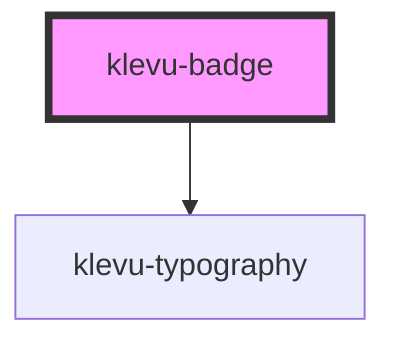

# klevu-badge

<!-- Auto Generated Below -->

## Overview

Basic badge component. Can be used to display small information on top of other elements. Typically
used to display things on top of product.

## Properties

| Property  | Attribute | Description                      | Type                  | Default     |
| --------- | --------- | -------------------------------- | --------------------- | ----------- |
| `accent`  | `accent`  | Setting a acceent color to badge | `number \| undefined` | `undefined` |
| `neutral` | `neutral` | Setting a neutral color to badge | `number \| undefined` | `undefined` |

## Events

| Event             | Description | Type                |
| ----------------- | ----------- | ------------------- |
| `klevuBadgeClose` |             | `CustomEvent<void>` |

## Slots

| Slot        | Description   |
| ----------- | ------------- |
| `"default"` | Badge content |

## Dependencies

### Depends on

- [klevu-typography](../klevu-typography)

### Graph

----------------------------------------------

*Built with [StencilJS](https://stenciljs.com/)*
