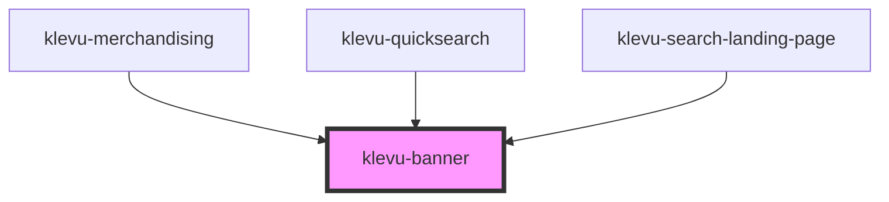

# klevu-banner

<!-- Auto Generated Below -->

## Overview

Component that displays a typical klevu banner

## Properties

| Property   | Attribute   | Description | Type                  | Default     |
| ---------- | ----------- | ----------- | --------------------- | ----------- |
| `altText`  | `alt-text`  |             | `string \| undefined` | `undefined` |
| `imageUrl` | `image-url` |             | `string \| undefined` | `undefined` |
| `linkUrl`  | `link-url`  |             | `string \| undefined` | `undefined` |
| `target`   | `target`    |             | `"_blank" \| "_self"` | `"_blank"`  |

## Events

| Event              | Description | Type               |
| ------------------ | ----------- | ------------------ |
| `klevuBannerClick` |             | `CustomEvent<any>` |

## Shadow Parts

| Part             | Description |
| ---------------- | ----------- |
| `"banner-image"` |             |

## Dependencies

### Used by

 - [klevu-merchandising](../klevu-merchandising)
 - [klevu-quicksearch](../klevu-quicksearch)
 - [klevu-search-landing-page](../klevu-search-landing-page)

### Graph

----------------------------------------------

