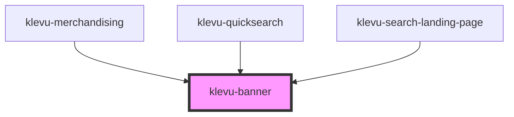

# klevu-banner

<!-- Auto Generated Below -->

## Overview

Component that displays a typical klevu banner

## Properties

| Property                | Attribute   | Description                       | Type                  | Default     |
| ----------------------- | ----------- | --------------------------------- | --------------------- | ----------- |
| `altText` _(required)_  | `alt-text`  | The alt text to display for iamge | `string`              | `undefined` |
| `imageUrl` _(required)_ | `image-url` | The image url to display          | `string`              | `undefined` |
| `linkUrl` _(required)_  | `link-url`  | The link url to navigate to       | `string`              | `undefined` |
| `target`                | `target`    | The target to open the link in    | `"_blank" \| "_self"` | `"_blank"`  |

## Events

| Event              | Description                                                                                                                                                 | Type                  |
| ------------------ | ----------------------------------------------------------------------------------------------------------------------------------------------------------- | --------------------- |
| `klevuBannerClick` | Event emitted when the banner is clicked. Sends the link url as the event detail  If defaultPrevented is called on the event, the link will not be followed | `CustomEvent<string>` |

## Shadow Parts

| Part             | Description |
| ---------------- | ----------- |
| `"banner-image"` |             |

## Dependencies

### Used by

 - [klevu-merchandising](../klevu-merchandising)
 - [klevu-quicksearch](../klevu-quicksearch)
 - [klevu-search-landing-page](../klevu-search-landing-page)

### Graph

----------------------------------------------

