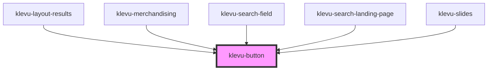

# klevu-button

<!-- Auto Generated Below -->

## Properties

| Property   | Attribute  | Description        | Type                   | Default     |
| ---------- | ---------- | ------------------ | ---------------------- | ----------- |
| `disabled` | `disabled` | Is button disabled | `boolean \| undefined` | `undefined` |

## Dependencies

### Used by

 - [klevu-layout-results](../klevu-layout-results)
 - [klevu-merchandising](../klevu-merchandising)
 - [klevu-search-field](../klevu-search-field)
 - [klevu-search-landing-page](../klevu-search-landing-page)
 - [klevu-slides](../klevu-slides)

### Graph

----------------------------------------------

*Built with [StencilJS](https://stenciljs.com/)*
