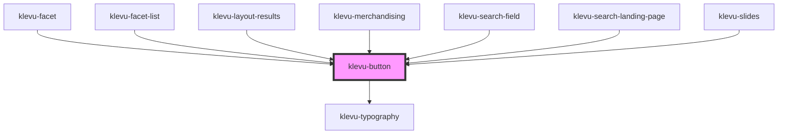

# klevu-button

<!-- Auto Generated Below -->

## Overview

Basic button component

## Properties

| Property      | Attribute      | Description                                               | Type                   | Default     |
| ------------- | -------------- | --------------------------------------------------------- | ---------------------- | ----------- |
| `disabled`    | `disabled`     | Is button disabled                                        | `boolean \| undefined` | `undefined` |
| `fullWidth`   | `full-width`   | Make button display block                                 | `boolean \| undefined` | `undefined` |
| `icon`        | `icon`         | Instead of content have an icon. So basically icon-button | `string \| undefined`  | `undefined` |
| `isSecondary` | `is-secondary` | Toned down secondary button                               | `boolean \| undefined` | `undefined` |
| `isTertiary`  | `is-tertiary`  | Toned down tertiary button                                | `boolean \| undefined` | `undefined` |

## Slots

| Slot        | Description |
| ----------- | ----------- |
| `"default"` | Button text |

## Shadow Parts

| Part              | Description |
| ----------------- | ----------- |
| `"material-icon"` |             |

## Dependencies

### Used by

 - [klevu-facet](../klevu-facet)
 - [klevu-facet-list](../klevu-facet-list)
 - [klevu-layout-results](../klevu-layout-results)
 - [klevu-merchandising](../klevu-merchandising)
 - [klevu-search-field](../klevu-search-field)
 - [klevu-search-landing-page](../klevu-search-landing-page)
 - [klevu-slides](../klevu-slides)

### Depends on

- [klevu-typography](../klevu-typography)

### Graph

----------------------------------------------

