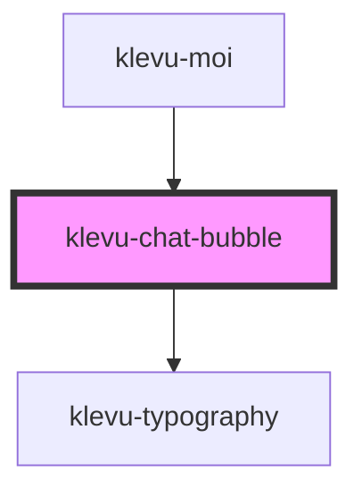

# klevu-chat-bubble

<!-- Auto Generated Below -->

## Overview

Container for chat items. Very simple component, just a wrapper.

## Properties

| Property | Attribute | Description | Type                   | Default     |
| -------- | --------- | ----------- | ---------------------- | ----------- |
| `remote` | `remote`  |             | `boolean \| undefined` | `undefined` |

## Dependencies

### Used by

 - [klevu-moi](../klevu-moi)

### Depends on

- [klevu-typography](../klevu-typography)

### Graph

----------------------------------------------

