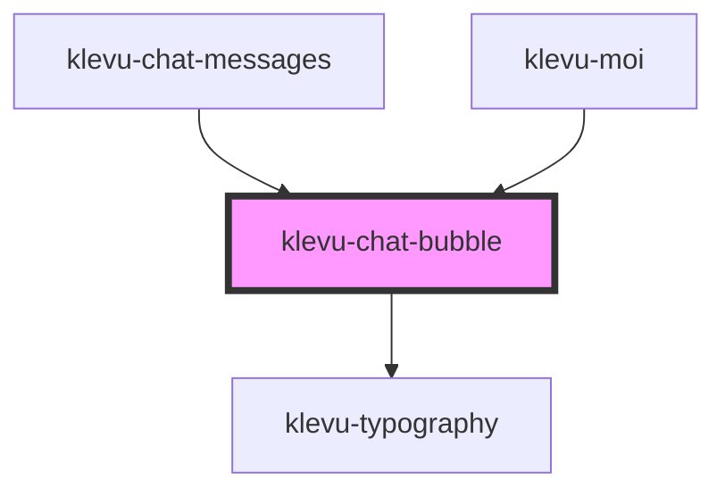

# klevu-chat-bubble

<!-- Auto Generated Below -->

## Overview

Container for chat items. Very simple component, just a wrapper.

## Properties

| Property   | Attribute  | Description                                  | Type                          | Default     |
| ---------- | ---------- | -------------------------------------------- | ----------------------------- | ----------- |
| `feedback` | `feedback` | Has user given feedback to this message      | `"down" \| "up" \| undefined` | `undefined` |
| `remote`   | `remote`   | Is the message from the user or from the bot | `boolean \| undefined`        | `undefined` |

## Shadow Parts

| Part              | Description |
| ----------------- | ----------- |
| `"material-icon"` |             |

## Dependencies

### Used by

 - [klevu-chat-messages](../klevu-chat-messages)
 - [klevu-moi](../klevu-moi)

### Depends on

- [klevu-typography](../klevu-typography)

### Graph

----------------------------------------------

