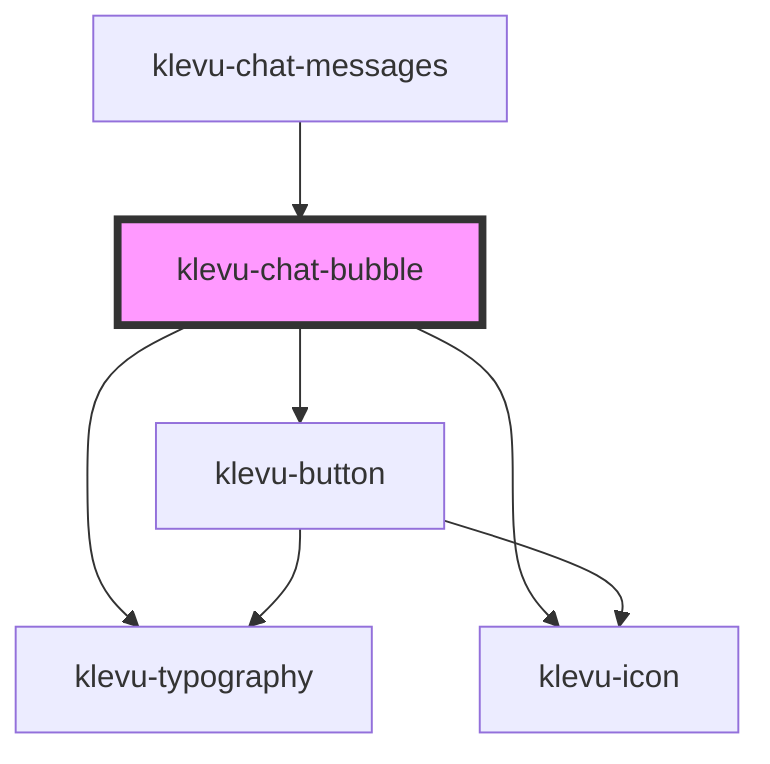

# klevu-chat-bubble

<!-- Auto Generated Below -->

## Overview

Container for chat items. Very simple component, just a wrapper.

## Properties

| Property          | Attribute         | Description                                        | Type                                                                                 | Default                                      |
| ----------------- | ----------------- | -------------------------------------------------- | ------------------------------------------------------------------------------------ | -------------------------------------------- |
| `feedback`        | --                | Has user given feedback to this message            | `undefined \| { id: string; thumbs: "up" \| "down"; reason?: string \| undefined; }` | `undefined`                                  |
| `feedbackReasons` | --                | List of feedback reasons to show after the message | `string[] \| undefined`                                                              | `undefined`                                  |
| `remote`          | `remote`          | Is the message from the user or from the bot       | `boolean \| undefined`                                                               | `undefined`                                  |
| `tRatingReason`   | `t-rating-reason` | Text for rating reason title                       | `any`                                                                                | `getTranslation("chatBubble.tRatingReason")` |

## Events

| Event                        | Description | Type                                                           |
| ---------------------------- | ----------- | -------------------------------------------------------------- |
| `klevuMessageFeedbackReason` |             | `CustomEvent<{ reason: string; feedback: MoiSavedFeedback; }>` |

## Dependencies

### Used by

 - [klevu-chat-messages](../klevu-chat-messages)

### Depends on

- [klevu-typography](../klevu-typography)
- [klevu-icon](../klevu-icon)
- [klevu-button](../klevu-button)

### Graph

----------------------------------------------

*Built with [StencilJS](https://stenciljs.com/)*
