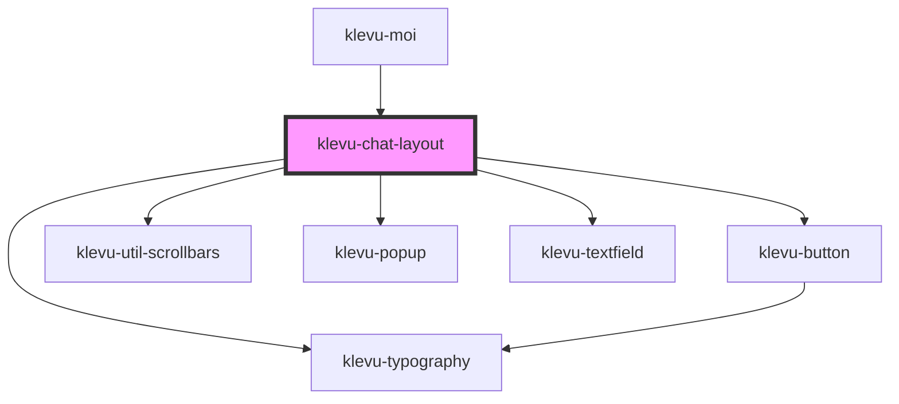

# klevu-chat-layout

<!-- Auto Generated Below -->

## Overview

Component that wraps chat elements into a layout.

## Properties

| Property      | Attribute      | Description            | Type      | Default |
| ------------- | -------------- | ---------------------- | --------- | ------- |
| `showClose`   | `show-close`   |                        | `boolean` | `false` |
| `showLoading` | `show-loading` | Show loading indicator | `boolean` | `false` |

## Events

| Event                        | Description                                    | Type                  |
| ---------------------------- | ---------------------------------------------- | --------------------- |
| `klevuChatLayoutClose`       | Event emitted when user closes the chat layout | `CustomEvent<void>`   |
| `klevuChatLayoutMessageSent` | Event emitted when user sends a message        | `CustomEvent<string>` |

## Methods

### `closePopup() => Promise<void>`

Close the popup menu

#### Returns

Type: `Promise<void>`

### `scrollMainToBottom() => Promise<void>`

Scroll current chat to bottom of page

#### Returns

Type: `Promise<void>`

## Dependencies

### Used by

 - [klevu-moi](../klevu-moi)

### Depends on

- [klevu-typography](../klevu-typography)
- [klevu-button](../klevu-button)
- [klevu-util-scrollbars](../klevu-util-scrollbars)
- [klevu-popup](../klevu-popup)
- [klevu-textfield](../klevu-textfield)

### Graph

----------------------------------------------

