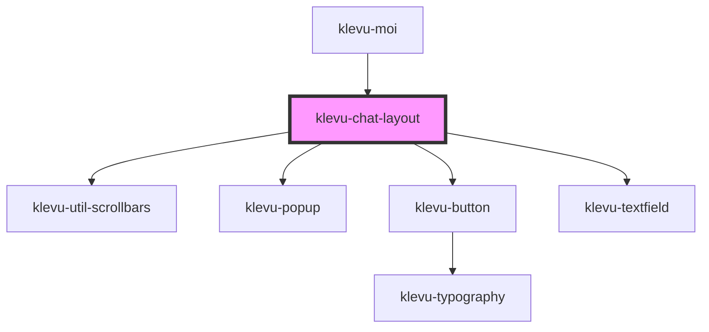

# klevu-chat-layout

<!-- Auto Generated Below -->

## Overview

Component that wraps chat elements into a layout.

## Events

| Event                        | Description                             | Type                  |
| ---------------------------- | --------------------------------------- | --------------------- |
| `klevuChatLayoutMessageSent` | Event emitted when user sends a message | `CustomEvent<string>` |

## Methods

### `scrollMainToBottom() => Promise<void>`

#### Returns

Type: `Promise<void>`

## Dependencies

### Used by

 - [klevu-moi](../klevu-moi)

### Depends on

- [klevu-util-scrollbars](../klevu-util-scrollbars)
- [klevu-popup](../klevu-popup)
- [klevu-button](../klevu-button)
- [klevu-textfield](../klevu-textfield)

### Graph

----------------------------------------------

