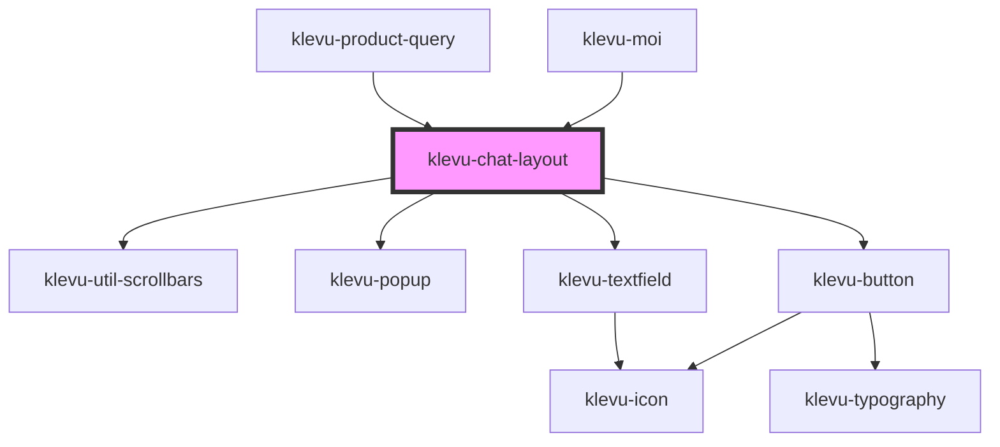

# klevu-chat-layout

<!-- Auto Generated Below -->

## Overview

Component that wraps chat elements into a layout.

## Properties

| Property                      | Attribute      | Description            | Type                       | Default     |
| ----------------------------- | -------------- | ---------------------- | -------------------------- | ----------- |
| `elementForHeightCalculation` | --             |                        | `HTMLElement \| undefined` | `undefined` |
| `showLoading`                 | `show-loading` | Show loading indicator | `boolean`                  | `false`     |

## Events

| Event                        | Description                             | Type                  |
| ---------------------------- | --------------------------------------- | --------------------- |
| `klevuChatLayoutMessageSent` | Event emitted when user sends a message | `CustomEvent<string>` |

## Methods

### `calcContentSize() => Promise<void>`

Recalculates and fills the content to the max height of the chat layout.
It can be used to force layout size calculation

#### Returns

Type: `Promise<void>`

### `closePopup() => Promise<void>`

Close the popup menu

#### Returns

Type: `Promise<void>`

### `scrollMainToBottom(behavior?: "smooth" | "instant") => Promise<void>`

Scroll current chat to bottom of page

#### Returns

Type: `Promise<void>`

## Slots

| Slot        | Description                                                                                                      |
| ----------- | ---------------------------------------------------------------------------------------------------------------- |
| `"actions"` | Actions to be placed in the footer                                                                               |
| `"default"` | Main content of the chat layout. Only one element should be used for this slot to make layout calculatios right. |
| `"footer"`  | Footer of the chat layout                                                                                        |
| `"header"`  | Header of the chat layout                                                                                        |

## Dependencies

### Used by

 - [klevu-moi](../klevu-moi)
 - [klevu-product-query](../klevu-product-query)

### Depends on

- [klevu-util-scrollbars](../klevu-util-scrollbars)
- [klevu-popup](../klevu-popup)
- [klevu-button](../klevu-button)
- [klevu-textfield](../klevu-textfield)

### Graph

----------------------------------------------

