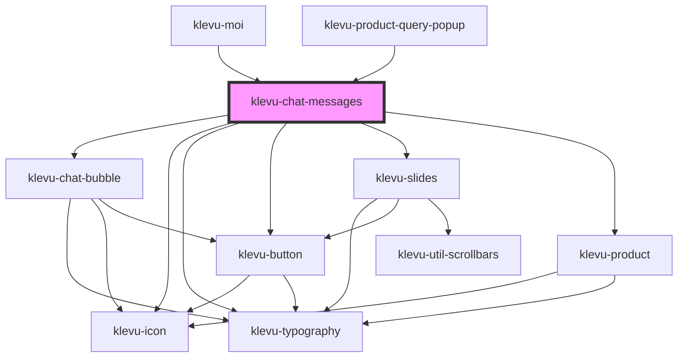

# klevu-chat-messages

<!-- Auto Generated Below -->

## Properties

| Property                | Attribute                 | Description                                         | Type                                                                         | Default     |
| ----------------------- | ------------------------- | --------------------------------------------------- | ---------------------------------------------------------------------------- | ----------- |
| `enableMessageFeedback` | `enable-message-feedback` | Should display a feedback button after each message | `boolean \| undefined`                                                       | `undefined` |
| `feedbacks`             | --                        | Feedbacks given by user                             | `MoiSavedFeedback[] \| undefined`                                            | `undefined` |
| `messages`              | --                        | Messages received from Moi backend                  | `(MoiResponseFilter \| MoiResponseText \| MoiProducts \| MoiLocalMessage)[]` | `[]`        |
| `showFeedbackFor`       | `show-feedback-for`       | What message should we                              | `string \| undefined`                                                        | `undefined` |

## Events

| Event                      | Description                    | Type                                                                                                                                                              |
| -------------------------- | ------------------------------ | ----------------------------------------------------------------------------------------------------------------------------------------------------------------- |
| `klevuChatProductClick`    | When product is clicked        | `CustomEvent<{ product: MoiProduct; }>`                                                                                                                           |
| `klevuMessageFeedback`     | When feedback is given         | `CustomEvent<{ message: { id: string; note: string \| null; type: "text"; value: string; collectFeedback?: boolean \| undefined; }; feedback: "up" \| "down"; }>` |
| `klevuSelectFilter`        | When product filter is clicked | `CustomEvent<{ message: MoiResponseFilter; filter: { count: string; name: string; selected: boolean \| null; value: string; }; }>`                                |
| `klevuSelectProductOption` | When product option is clicked | `CustomEvent<{ product: MoiProduct; option: { chat: string; intent: string; name: string; }; }>`                                                                  |

## Slots

| Slot                    | Description                               |
| ----------------------- | ----------------------------------------- |
| `"chat-messages-after"` | Things to place in the after all messages |

## Dependencies

### Used by

 - [klevu-moi](../klevu-moi)
 - [klevu-product-query-popup](../klevu-product-query-popup)

### Depends on

- [klevu-chat-bubble](../klevu-chat-bubble)
- [klevu-icon](../klevu-icon)
- [klevu-typography](../klevu-typography)
- [klevu-button](../klevu-button)
- [klevu-slides](../klevu-slides)
- [klevu-product](../klevu-product)

### Graph

----------------------------------------------

