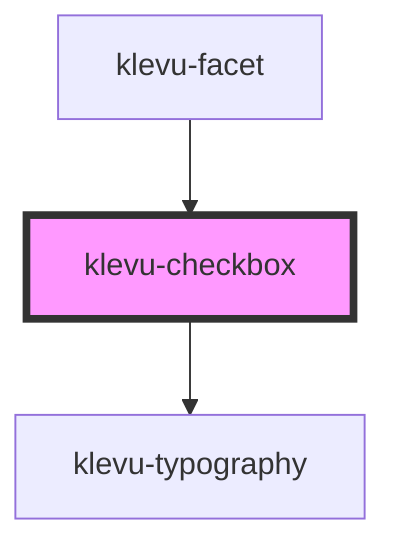

# klevu-checkbox

<!-- Auto Generated Below -->

## Overview

Checkbox component

## Properties

| Property   | Attribute  | Description          | Type                   | Default     |
| ---------- | ---------- | -------------------- | ---------------------- | ----------- |
| `checked`  | `checked`  | Is checkbox checked  | `boolean \| undefined` | `undefined` |
| `disabled` | `disabled` | Is disabled          | `boolean \| undefined` | `undefined` |
| `name`     | `name`     | Name of the checkbox | `string \| undefined`  | `undefined` |

## Events

| Event                 | Description | Type                   |
| --------------------- | ----------- | ---------------------- |
| `klevuCheckboxChange` |             | `CustomEvent<boolean>` |

## Shadow Parts

| Part              | Description |
| ----------------- | ----------- |
| `"material-icon"` |             |

## Dependencies

### Used by

 - [klevu-facet](../klevu-facet)

### Depends on

- [klevu-typography](../klevu-typography)

### Graph

----------------------------------------------

