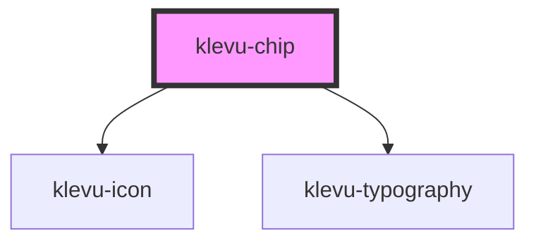

# klevu-chip

<!-- Auto Generated Below -->

## Overview

Chip component that is used to display selected value in a listing. Gives also ability to remove the chip.

Has selected and removable attributes that can be used to display the chip in selected state and also to remove the chip.

## Properties

| Property    | Attribute   | Description                 | Type      | Default |
| ----------- | ----------- | --------------------------- | --------- | ------- |
| `removable` | `removable` | Removable state of the chip | `boolean` | `false` |
| `selected`  | `selected`  | Selected state of the chip  | `boolean` | `false` |

## Events

| Event             | Description                              | Type                |
| ----------------- | ---------------------------------------- | ------------------- |
| `klevuChipRemove` | Event that is fired when chip is removed | `CustomEvent<void>` |

## Dependencies

### Depends on

- [klevu-icon](../klevu-icon)
- [klevu-typography](../klevu-typography)

### Graph

----------------------------------------------

*Built with [StencilJS](https://stenciljs.com/)*
