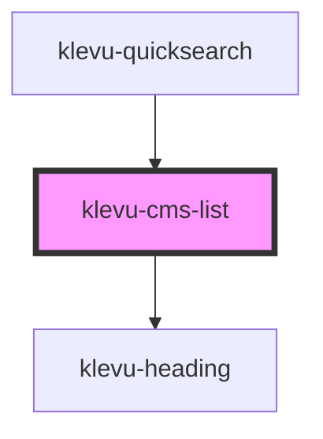

# klevu-cms-list

<!-- Auto Generated Below -->

## Overview

Component to display list of CMS page results

## Properties

| Property             | Attribute | Description                                         | Type                     | Default       |
| -------------------- | --------- | --------------------------------------------------- | ------------------------ | ------------- |
| `caption`            | `caption` | Caption of the listing                              | `string`                 | `"CMS pages"` |
| `link`               | `link`    | Should use url parameter from link to create anchor | `boolean \| undefined`   | `undefined`   |
| `pages` _(required)_ | --        | List of Klevu results records with type of Page     | `Partial<KlevuRecord>[]` | `undefined`   |

## Events

| Event               | Description | Type                                                                                                                                                                                                                                                                                                                                                                                                                                                                                                                                                                                                                                                                                                                                                                                                                                                                                                                                                                                                                                                                                                                                                                                                                                                                                                                                                                                                                                          |
| ------------------- | ----------- | --------------------------------------------------------------------------------------------------------------------------------------------------------------------------------------------------------------------------------------------------------------------------------------------------------------------------------------------------------------------------------------------------------------------------------------------------------------------------------------------------------------------------------------------------------------------------------------------------------------------------------------------------------------------------------------------------------------------------------------------------------------------------------------------------------------------------------------------------------------------------------------------------------------------------------------------------------------------------------------------------------------------------------------------------------------------------------------------------------------------------------------------------------------------------------------------------------------------------------------------------------------------------------------------------------------------------------------------------------------------------------------------------------------------------------------------- |
| `klevuCmsPageClick` |             | `CustomEvent<{ [x: string]: any; brand?: string \| undefined; category?: string \| undefined; currency?: string \| undefined; deliveryInfo?: string \| undefined; discount?: string \| undefined; freeShipping?: string \| undefined; groupPrices?: string \| undefined; hideAddToCart?: string \| undefined; hideGroupPrices?: string \| undefined; id?: string \| undefined; image?: string \| undefined; imageHover?: string \| undefined; imageUrl?: string \| undefined; inStock?: string \| undefined; itemGroupId?: string \| undefined; klevu_category?: string \| undefined; klevu_manual_boosting?: number \| undefined; klevu_bulk_boosting?: number \| undefined; klevu_selflearning_boosting?: number \| undefined; name?: string \| undefined; price?: string \| undefined; rating?: number \| undefined; salePrice?: string \| undefined; shortDesc?: string \| undefined; sku?: string \| undefined; score?: number \| undefined; startPrice?: string \| undefined; storeBaseCurrency?: string \| undefined; swatchesInfo?: string \| undefined; tags?: string \| undefined; toPrice?: string \| undefined; totalVariants?: number \| undefined; type?: string \| undefined; typeOfRecord?: KlevuAnyTypeOfRecord \| undefined; url?: string \| undefined; weight?: string \| undefined; swatches?: { id: string; color: string; swatchImage: string; image: string; numberOfAdditionalVariants: string; }[] \| undefined; }>` |

## Shadow Parts

| Part           | Description |
| -------------- | ----------- |
| `"klevu-list"` |             |

## Dependencies

### Used by

 - [klevu-quicksearch](../klevu-quicksearch)

### Depends on

- [klevu-heading](../klevu-heading)

### Graph

----------------------------------------------

*Built with [StencilJS](https://stenciljs.com/)*
