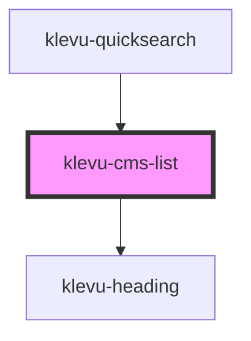

# klevu-cms-list

<!-- Auto Generated Below -->

## Properties

| Property  | Attribute | Description | Type                     | Default       |
| --------- | --------- | ----------- | ------------------------ | ------------- |
| `caption` | `caption` |             | `string`                 | `"CMS pages"` |
| `link`    | `link`    |             | `boolean`                | `undefined`   |
| `pages`   | --        |             | `Partial<KlevuRecord>[]` | `undefined`   |

## Events

| Event               | Description | Type                                                                                                                                                                                                                                                                                                                                                                                                                                                                                                                                                                                                                                                                                                                                                                                                                                                                                                                                         |
| ------------------- | ----------- | -------------------------------------------------------------------------------------------------------------------------------------------------------------------------------------------------------------------------------------------------------------------------------------------------------------------------------------------------------------------------------------------------------------------------------------------------------------------------------------------------------------------------------------------------------------------------------------------------------------------------------------------------------------------------------------------------------------------------------------------------------------------------------------------------------------------------------------------------------------------------------------------------------------------------------------------- |
| `klevuCmsPageClick` |             | `CustomEvent<{ [x: string]: any; brand?: string; category?: string; currency?: string; deliveryInfo?: string; discount?: string; freeShipping?: string; groupPrices?: string; hideAddToCart?: string; hideGroupPrices?: string; id?: string; image?: string; imageHover?: string; imageUrl?: string; inStock?: string; itemGroupId?: string; klevu_category?: string; klevu_manual_boosting?: number; klevu_bulk_boosting?: number; klevu_selflearning_boosting?: number; name?: string; price?: string; rating?: number; salePrice?: string; shortDesc?: string; sku?: string; score?: number; startPrice?: string; storeBaseCurrency?: string; swatchesInfo?: string; tags?: string; toPrice?: string; totalVariants?: number; type?: string; typeOfRecord?: KlevuAnyTypeOfRecord; url?: string; weight?: string; swatches?: { id: string; color: string; swatchImage: string; image: string; numberOfAdditionalVariants: string; }[]; }>` |

## Shadow Parts

| Part           | Description |
| -------------- | ----------- |
| `"klevu-list"` |             |

## Dependencies

### Used by

 - [klevu-quicksearch](../klevu-quicksearch)

### Depends on

- [klevu-heading](../klevu-heading)

### Graph

----------------------------------------------

*Built with [StencilJS](https://stenciljs.com/)*
