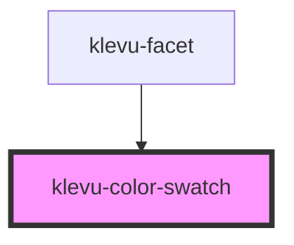

# klevu-color-swatch

<!-- Auto Generated Below -->

## Overview

Color Swatch component

## Properties

| Property                | Attribute      | Description                                   | Type                  | Default     |
| ----------------------- | -------------- | --------------------------------------------- | --------------------- | ----------- |
| `borderColor`           | `border-color` | Specify border color for the swatch           | `string \| undefined` | `undefined` |
| `color`                 | `color`        | Color to apply                                | `string \| undefined` | `undefined` |
| `imageUrl`              | `image-url`    | ImageUrl to load in swatch                    | `string \| undefined` | `undefined` |
| `name` _(required)_     | `name`         | This field will be sent in the click callback | `string`              | `undefined` |
| `selected` _(required)_ | `selected`     | If selected                                   | `boolean`             | `undefined` |

## Events

| Event              | Description                  | Type                             |
| ------------------ | ---------------------------- | -------------------------------- |
| `klevuSwatchClick` | When swatch has been clicked | `CustomEvent<{ name: string; }>` |

## Dependencies

### Used by

 - [klevu-facet](../klevu-facet)

### Graph

----------------------------------------------

*Built with [StencilJS](https://stenciljs.com/)*
