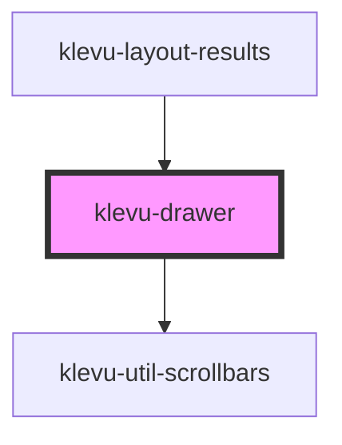

# klevu-drawer

<!-- Auto Generated Below -->

## Overview

Component to create offscreen drawer on left or right side of the screen

## Properties

| Property              | Attribute                | Description                                    | Type                   | Default     |
| --------------------- | ------------------------ | ---------------------------------------------- | ---------------------- | ----------- |
| `anchor`              | `anchor`                 | Anchor to right or left side of the page       | `"left" \| "right"`    | `"right"`   |
| `background`          | `background`             | Display dim background on top of other content | `boolean \| undefined` | `undefined` |
| `closeAtOutsideClick` | `close-at-outside-click` | Close by clicking outside of drawer            | `boolean`              | `true`      |
| `insertYPadding`      | `insert-y-padding`       | Add little bit of padding to content of drawer | `boolean \| undefined` | `undefined` |
| `startOpen`           | `start-open`             | Start side drawer open                         | `boolean \| undefined` | `undefined` |

## Methods

### `closeModal() => Promise<void>`

#### Returns

Type: `Promise<void>`

### `openModal() => Promise<void>`

#### Returns

Type: `Promise<void>`

## Slots

| Slot        | Description                                          |
| ----------- | ---------------------------------------------------- |
| `"content"` | Content to display in drawer                         |
| `"origin"`  | When origin element is clicked then content is shown |

## Dependencies

### Used by

 - [klevu-layout-results](../klevu-layout-results)

### Depends on

- [klevu-util-scrollbars](../klevu-util-scrollbars)

### Graph

----------------------------------------------

*Built with [StencilJS](https://stenciljs.com/)*
