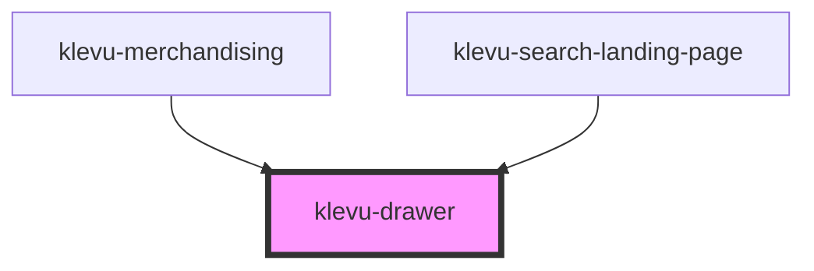

# klevu-drawer

<!-- Auto Generated Below -->

## Properties

| Property              | Attribute                | Description | Type                   | Default     |
| --------------------- | ------------------------ | ----------- | ---------------------- | ----------- |
| `anchor`              | `anchor`                 |             | `"left" \| "right"`    | `"right"`   |
| `background`          | `background`             |             | `boolean \| undefined` | `undefined` |
| `closeAtOutsideClick` | `close-at-outside-click` |             | `boolean`              | `true`      |
| `startOpen`           | `start-open`             |             | `boolean \| undefined` | `undefined` |

## Methods

### `closeModal() => Promise<void>`

#### Returns

Type: `Promise<void>`

### `openModal() => Promise<void>`

#### Returns

Type: `Promise<void>`

## Dependencies

### Used by

 - [klevu-merchandising](../klevu-merchandising)
 - [klevu-search-landing-page](../klevu-search-landing-page)

### Graph

----------------------------------------------

*Built with [StencilJS](https://stenciljs.com/)*
