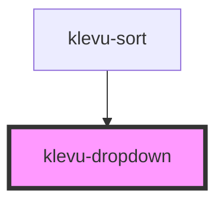

# klevu-dropdown

<!-- Auto Generated Below -->

## Properties

| Property               | Attribute  | Description | Type                                 | Default     |
| ---------------------- | ---------- | ----------- | ------------------------------------ | ----------- |
| `disabled`             | `disabled` |             | `boolean \| undefined`               | `undefined` |
| `name` _(required)_    | `name`     |             | `string`                             | `undefined` |
| `options` _(required)_ | --         |             | `{ value: string; text: String; }[]` | `undefined` |

## Events

| Event                  | Description | Type                  |
| ---------------------- | ----------- | --------------------- |
| `klevuDropdownChanged` |             | `CustomEvent<string>` |

## Dependencies

### Used by

 - [klevu-sort](../klevu-sort)

### Graph

----------------------------------------------

*Built with [StencilJS](https://stenciljs.com/)*
