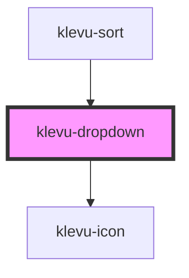

# klevu-dropdown

<!-- Auto Generated Below -->

## Overview

Simple native dropdown component for dropdown

## Properties

| Property                | Attribute  | Description                     | Type                                 | Default     |
| ----------------------- | ---------- | ------------------------------- | ------------------------------------ | ----------- |
| `disabled`              | `disabled` | Is element disabled             | `boolean \| undefined`               | `undefined` |
| `name` _(required)_     | `name`     | Form name                       | `string`                             | `undefined` |
| `options` _(required)_  | --         | Options to display in dropdown  | `{ value: string; text: String; }[]` | `undefined` |
| `selected` _(required)_ | `selected` | Which element value is selected | `string`                             | `undefined` |
| `variant`               | `variant`  | Variant of dropdown             | `"default" \| "inline"`              | `"default"` |

## Events

| Event                  | Description                         | Type                  |
| ---------------------- | ----------------------------------- | --------------------- |
| `klevuDropdownChanged` | When dropdown item has been changed | `CustomEvent<string>` |

## Dependencies

### Used by

 - [klevu-sort](../klevu-sort)

### Depends on

- [klevu-icon](../klevu-icon)

### Graph

----------------------------------------------

*Built with [StencilJS](https://stenciljs.com/)*
