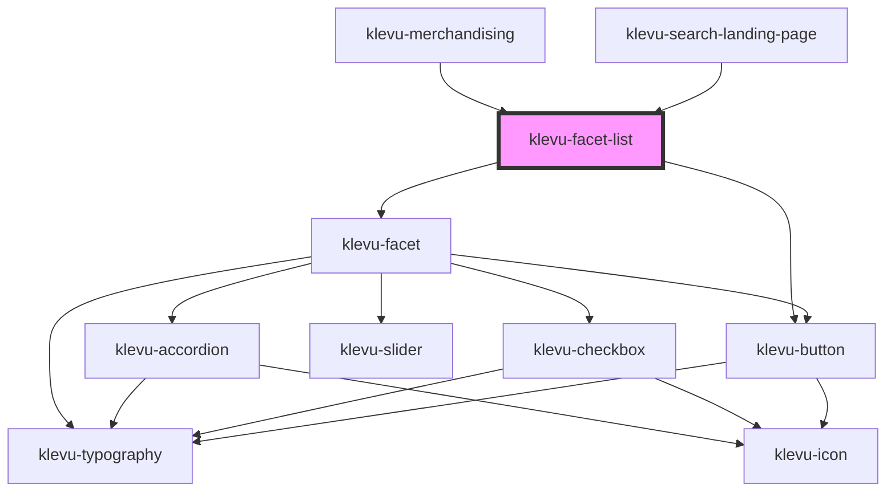

# klevu-facet-list

<!-- Auto Generated Below -->

## Overview

Render all facets of filter manager

## Properties

| Property               | Attribute             | Description                                                                                      | Type                                                                       | Default     |
| ---------------------- | --------------------- | ------------------------------------------------------------------------------------------------ | -------------------------------------------------------------------------- | ----------- |
| `accordion`            | `accordion`           | Should use accordions to for facets                                                              | `boolean \| undefined`                                                     | `undefined` |
| `applyButtonText`      | `apply-button-text`   | Button text for Apply button when using `useApplyButton`                                         | `string`                                                                   | `"Apply"`   |
| `clearButtonText`      | `clear-button-text`   | Button text for Clear button when using `useApplyButton`                                         | `string`                                                                   | `"Clear"`   |
| `customOrder`          | --                    | Custom order keys for every facet                                                                | `undefined \| { [key: string]: string[]; }`                                | `undefined` |
| `defaultPriceLabel`    | `default-price-label` | Default price label for sliders                                                                  | `string`                                                                   | `"Price"`   |
| `manager` _(required)_ | --                    | Filter managet from which the list is built from                                                 | `FilterManager`                                                            | `undefined` |
| `mode`                 | `mode`                | Set mode for facets or if object is passed then define per key                                   | `"checkbox" \| "radio" \| undefined \| { [key: string]: KlevuFacetMode; }` | `undefined` |
| `useApplyButton`       | `use-apply-button`    | Display "apply filters" button in the end. And do not apply filters until this button is pressed | `boolean \| undefined`                                                     | `undefined` |

## Events

| Event               | Description              | Type                                       |
| ------------------- | ------------------------ | ------------------------------------------ |
| `klevuApplyFilters` | When filters are applied | `CustomEvent<{ manager: FilterManager; }>` |

## Methods

### `updateApplyFilterState() => Promise<void>`

When using `useApplyButton` then this method can be used to update current state filterManager
into to local state of that is displayed in the UI

#### Returns

Type: `Promise<void>`

## Dependencies

### Used by

 - [klevu-merchandising](../klevu-merchandising)
 - [klevu-search-landing-page](../klevu-search-landing-page)

### Depends on

- [klevu-facet](../klevu-facet)
- [klevu-button](../klevu-button)

### Graph

----------------------------------------------

