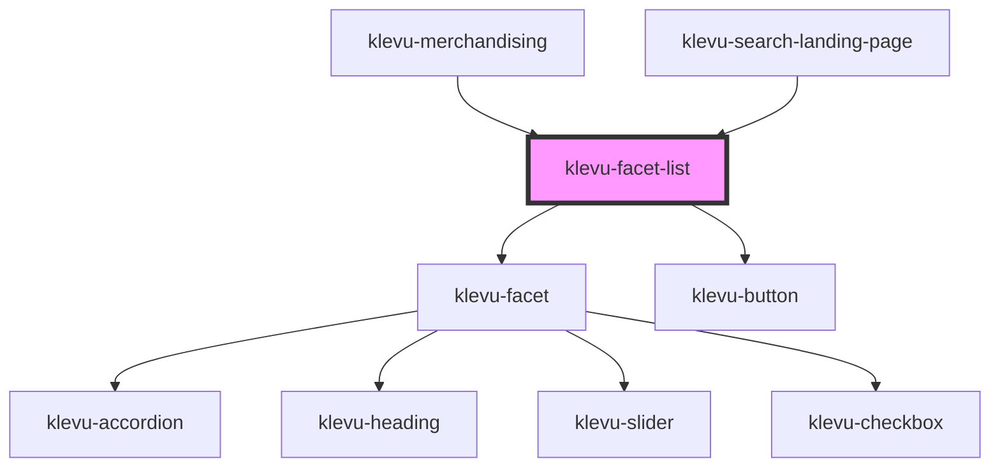

# klevu-facet-list

<!-- Auto Generated Below -->

## Overview

Render all facets of filter manager

## Properties

| Property               | Attribute          | Description                                                                                      | Type                                                                       | Default     |
| ---------------------- | ------------------ | ------------------------------------------------------------------------------------------------ | -------------------------------------------------------------------------- | ----------- |
| `accordion`            | `accordion`        | Should use accordions to for facets                                                              | `boolean \| undefined`                                                     | `undefined` |
| `customOrder`          | --                 | Custom order keys for every facet                                                                | `undefined \| { [key: string]: string[]; }`                                | `undefined` |
| `manager` _(required)_ | --                 | Filter managet from which the list is built from                                                 | `FilterManager`                                                            | `undefined` |
| `mode`                 | `mode`             | Set mode for facets or if object is passed then define per key                                   | `"checkbox" \| "radio" \| undefined \| { [key: string]: KlevuFacetMode; }` | `undefined` |
| `useApplyButton`       | `use-apply-button` | Display "apply filters" button in the end. And do not apply filters until this button is pressed | `boolean \| undefined`                                                     | `undefined` |

## Events

| Event               | Description              | Type                |
| ------------------- | ------------------------ | ------------------- |
| `klevuApplyFilters` | When filters are applied | `CustomEvent<void>` |

## Dependencies

### Used by

 - [klevu-merchandising](../klevu-merchandising)
 - [klevu-search-landing-page](../klevu-search-landing-page)

### Depends on

- [klevu-facet](../klevu-facet)
- [klevu-button](../klevu-button)

### Graph

----------------------------------------------

*Built with [StencilJS](https://stenciljs.com/)*
