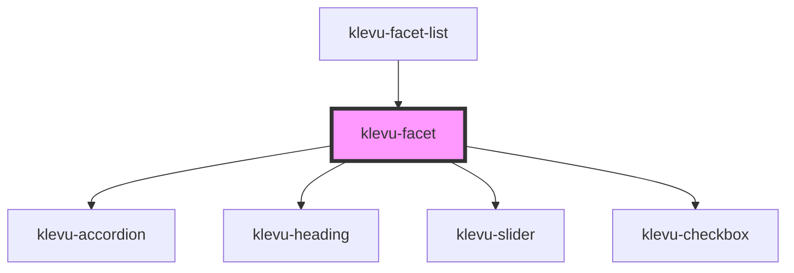

# klevu-facet

<!-- Auto Generated Below -->

## Properties

| Property               | Attribute              | Description                                                                   | Type                                                                                                                                                 | Default      |
| ---------------------- | ---------------------- | ----------------------------------------------------------------------------- | ---------------------------------------------------------------------------------------------------------------------------------------------------- | ------------ |
| `accordion`            | `accordion`            | Should the facet be in accordion                                              | `boolean \| undefined`                                                                                                                               | `undefined`  |
| `accordionStartOpen`   | `accordion-start-open` | Start accordion open                                                          | `boolean \| undefined`                                                                                                                               | `undefined`  |
| `customOrder`          | --                     | Set predefined order for options. Unfound values are in original order in end | `string[] \| undefined`                                                                                                                              | `undefined`  |
| `manager` _(required)_ | --                     | Originating filter manager which to modify                                    | `FilterManager`                                                                                                                                      | `undefined`  |
| `mode`                 | `mode`                 | Which mode should facets be in                                                | `"checkbox" \| "radio"`                                                                                                                              | `"checkbox"` |
| `option`               | --                     | From which options to build facet                                             | `KlevuFilterResult & { type: KlevuFilterType.Options; options: { name: string; value: string; count: number; selected: boolean; }[]; } \| undefined` | `undefined`  |
| `slider`               | --                     | From which slider to build facet                                              | `KlevuFilterResult & { type: KlevuFilterType.Slider; min: string; max: string; start: string; end: string; } \| undefined`                           | `undefined`  |

## Shadow Parts

| Part           | Description |
| -------------- | ----------- |
| `"klevu-list"` |             |

## Dependencies

### Used by

 - [klevu-facet-list](../klevu-facet-list)

### Depends on

- [klevu-accordion](../klevu-accordion)
- [klevu-heading](../klevu-heading)
- [klevu-slider](../klevu-slider)
- [klevu-checkbox](../klevu-checkbox)

### Graph

----------------------------------------------

*Built with [StencilJS](https://stenciljs.com/)*
