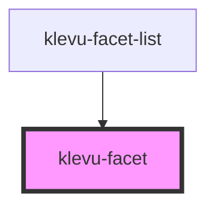

# klevu-facet

<!-- Auto Generated Below -->

## Properties

| Property               | Attribute | Description | Type                                                                                                                                    | Default     |
| ---------------------- | --------- | ----------- | --------------------------------------------------------------------------------------------------------------------------------------- | ----------- |
| `manager` _(required)_ | --        |             | `FilterManager`                                                                                                                         | `undefined` |
| `option`               | --        |             | `KlevuFilterResult & { type: KlevuFilterType.Options; options: { name: string; value: string; count: number; selected: boolean; }[]; }` | `undefined` |
| `slider`               | --        |             | `KlevuFilterResult & { type: KlevuFilterType.Slider; min: string; max: string; start: string; end: string; }`                           | `undefined` |

## Dependencies

### Used by

 - [klevu-facet-list](../klevu-facet-list)

### Graph

```mermaid
graph TD;
  klevu-facet-list --> klevu-facet
  style klevu-facet fill:#f9f,stroke:#333,stroke-width:4px
```

----------------------------------------------

*Built with [StencilJS](https://stenciljs.com/)*
