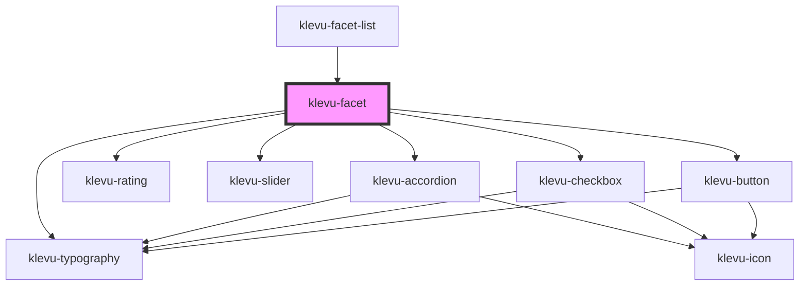

# klevu-facet

<!-- Auto Generated Below -->

## Overview

Rendering items of single facet with all its options or a slider.

Manager property must be set for this component to work.

## Properties

| Property               | Attribute              | Description                                                                                                                                               | Type                                                                                                                                                                           | Default      |
| ---------------------- | ---------------------- | --------------------------------------------------------------------------------------------------------------------------------------------------------- | ------------------------------------------------------------------------------------------------------------------------------------------------------------------------------ | ------------ |
| `accordion`            | `accordion`            | Should the facet be in accordion                                                                                                                          | `boolean \| undefined`                                                                                                                                                         | `undefined`  |
| `accordionStartOpen`   | `accordion-start-open` | Start accordion open                                                                                                                                      | `boolean \| undefined`                                                                                                                                                         | `undefined`  |
| `customOrder`          | --                     | Set predefined order for options. Unfound values are in original order in end                                                                             | `string[] \| undefined`                                                                                                                                                        | `undefined`  |
| `labelOverride`        | `label-override`       | Override label text with custom value                                                                                                                     | `string \| undefined`                                                                                                                                                          | `undefined`  |
| `manager` _(required)_ | --                     | Originating filter manager which to modify. This is the most important property of the component. It will be used to modify the filter state for queries. | `FilterManager`                                                                                                                                                                | `undefined`  |
| `mode`                 | `mode`                 | Which mode should facets be in                                                                                                                            | `"checkbox" \| "radio"`                                                                                                                                                        | `"checkbox"` |
| `option`               | --                     | From which options to build facet. Single option value from Klevu SDK FilterManager. Either this or slider must be set.                                   | `KlevuFilterResult & { type: KlevuFilterType.Options \| KlevuFilterType.Rating; options: { name: string; value: string; count: number; selected: boolean; }[]; } \| undefined` | `undefined`  |
| `slider`               | --                     | From which slider to build facet.                                                                                                                         | `KlevuFilterResult & { type: KlevuFilterType.Slider; min: string; max: string; start: string \| null; end: string \| null; } \| undefined`                                     | `undefined`  |

## Events

| Event                        | Description                      | Type                                                                                                                                                                                      |
| ---------------------------- | -------------------------------- | ----------------------------------------------------------------------------------------------------------------------------------------------------------------------------------------- |
| `klevuFilterSelectionUpdate` | When filter selection is updated | `CustomEvent<{ manager: FilterManager; filter?: { key: string; name: string; selected?: boolean \| undefined; start?: string \| undefined; end?: string \| undefined; } \| undefined; }>` |

## Dependencies

### Used by

 - [klevu-facet-list](../klevu-facet-list)

### Depends on

- [klevu-accordion](../klevu-accordion)
- [klevu-rating](../klevu-rating)
- [klevu-typography](../klevu-typography)
- [klevu-slider](../klevu-slider)
- [klevu-checkbox](../klevu-checkbox)
- [klevu-button](../klevu-button)

### Graph

----------------------------------------------

