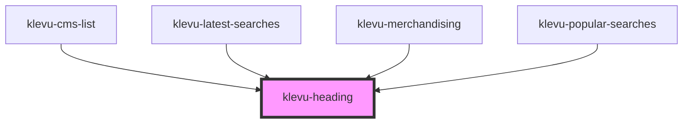

# klevu-heading

<!-- Auto Generated Below -->

## Properties

| Property  | Attribute | Description | Type                   | Default |
| --------- | --------- | ----------- | ---------------------- | ------- |
| `variant` | `variant` |             | `"h1" \| "h2" \| "h3"` | `"h2"`  |

## Dependencies

### Used by

 - [klevu-cms-list](../klevu-cms-list)
 - [klevu-latest-searches](../klevu-latest-searches)
 - [klevu-merchandising](../klevu-merchandising)
 - [klevu-popular-searches](../klevu-popular-searches)

### Graph

----------------------------------------------

*Built with [StencilJS](https://stenciljs.com/)*
