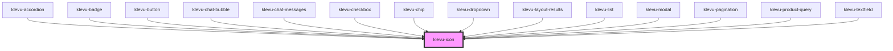

# klevu-icon

<!-- Auto Generated Below -->

## Overview

Klevu icon component. Uses Google Material Icons.

## Properties

| Property            | Attribute | Description                                           | Type     | Default     |
| ------------------- | --------- | ----------------------------------------------------- | -------- | ----------- |
| `name` _(required)_ | `name`    | Name of the icon. Please use tokens of material icons | `string` | `undefined` |

## Dependencies

### Used by

 - [klevu-accordion](../klevu-accordion)
 - [klevu-badge](../klevu-badge)
 - [klevu-button](../klevu-button)
 - [klevu-chat-bubble](../klevu-chat-bubble)
 - [klevu-chat-messages](../klevu-chat-messages)
 - [klevu-checkbox](../klevu-checkbox)
 - [klevu-chip](../klevu-chip)
 - [klevu-dropdown](../klevu-dropdown)
 - [klevu-layout-results](../klevu-layout-results)
 - [klevu-list](../klevu-list)
 - [klevu-modal](../klevu-modal)
 - [klevu-pagination](../klevu-pagination)
 - [klevu-product-query](../klevu-product-query)
 - [klevu-textfield](../klevu-textfield)

### Graph

----------------------------------------------

