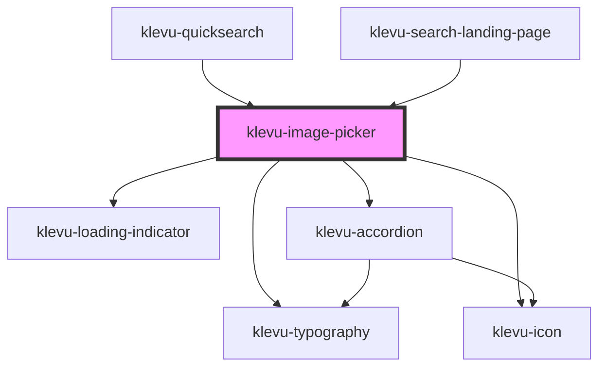

# klevu-image-picker

<!-- Auto Generated Below -->

## Properties

| Property      | Attribute       | Description                             | Type      | Default |
| ------------- | --------------- | --------------------------------------- | --------- | ------- |
| `isLoading`   | `is-loading`    | To be used to display loading indicator | `boolean` | `false` |
| `maxFileSize` | `max-file-size` | Provide max file size in MBs            | `number`  | `5`     |

## Events

| Event                | Description                                    | Type                                          |
| -------------------- | ---------------------------------------------- | --------------------------------------------- |
| `klevuImageSelected` | This event is fired when an image is selected. | `CustomEvent<{ name: string; image: Blob; }>` |

## Dependencies

### Used by

 - [klevu-quicksearch](../klevu-quicksearch)
 - [klevu-search-landing-page](../klevu-search-landing-page)

### Depends on

- [klevu-typography](../klevu-typography)
- [klevu-loading-indicator](../klevu-loading-indicator)
- [klevu-icon](../klevu-icon)
- [klevu-accordion](../klevu-accordion)

### Graph

----------------------------------------------

