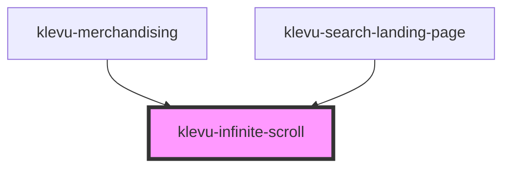

# klevu-infinite-scroll

<!-- Auto Generated Below -->

## Overview

Component that triggers event when intercepted on scroll of page.

## Properties

| Property                       | Attribute                         | Description | Type      | Default |
| ------------------------------ | --------------------------------- | ----------- | --------- | ------- |
| `enabled`                      | `enabled`                         |             | `boolean` | `false` |
| `infiniteScrollPauseThreshold` | `infinite-scroll-pause-threshold` |             | `number`  | `3`     |

## Events

| Event                     | Description | Type                |
| ------------------------- | ----------- | ------------------- |
| `infiniteScrollingPaused` |             | `CustomEvent<void>` |
| `loadMore`                |             | `CustomEvent<void>` |

## Dependencies

### Used by

 - [klevu-merchandising](../klevu-merchandising)
 - [klevu-search-landing-page](../klevu-search-landing-page)

### Graph

----------------------------------------------

