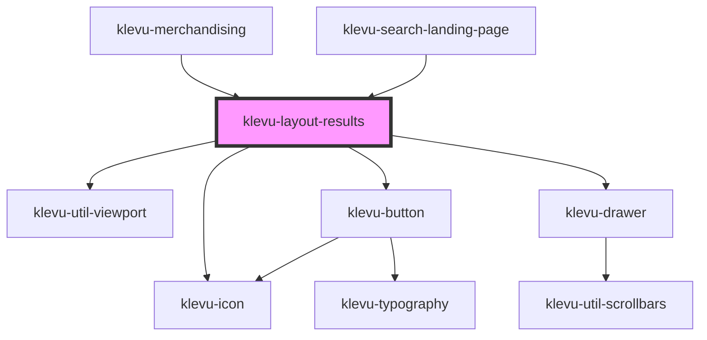

# klevu-layout-results

<!-- Auto Generated Below -->

## Overview

Generic layout used in merchansiding and search landing page

## Events

| Event               | Description | Type                |
| ------------------- | ----------- | ------------------- |
| `klevuDrawerOpened` |             | `CustomEvent<void>` |

## Methods

### `closeDrawer() => Promise<void>`

Can be used to close the drawer programmatically

#### Returns

Type: `Promise<void>`

## Slots

| Slot        | Description                   |
| ----------- | ----------------------------- |
| `"content"` | Main content                  |
| `"footer"`  | Footer are below the content  |
| `"header"`  | Header area above the content |
| `"sidebar"` | Sidebar                       |

## Dependencies

### Used by

 - [klevu-merchandising](../klevu-merchandising)
 - [klevu-search-landing-page](../klevu-search-landing-page)

### Depends on

- [klevu-util-viewport](../klevu-util-viewport)
- [klevu-button](../klevu-button)
- [klevu-icon](../klevu-icon)
- [klevu-drawer](../klevu-drawer)

### Graph

----------------------------------------------

