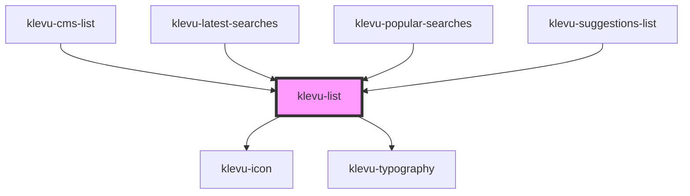

# klevu-list

<!-- Auto Generated Below -->

## Overview

Single list item for listing things.

## Properties

| Property     | Attribute      | Description                                                       | Type                  | Default     |
| ------------ | -------------- | ----------------------------------------------------------------- | --------------------- | ----------- |
| `condensed`  | `condensed`    | Condensed version of the list item.                               | `boolean`             | `false`     |
| `icon`       | `icon`         | Icon to be displayed in the list item. Cannot be used with image. | `string \| undefined` | `undefined` |
| `image`      | `image`        | Image to be displayed in the list item. Cannot be used with icon. | `string \| undefined` | `undefined` |
| `noXPadding` | `no-x-padding` |                                                                   | `boolean`             | `false`     |
| `url`        | `url`          | Make the whole thing clickable and navigate to this url.          | `string \| undefined` | `undefined` |

## Slots

| Slot          | Description    |
| ------------- | -------------- |
| `"primary"`   | Primary text   |
| `"secondary"` | Secondary text |

## Dependencies

### Used by

 - [klevu-cms-list](../klevu-cms-list)
 - [klevu-latest-searches](../klevu-latest-searches)
 - [klevu-popular-searches](../klevu-popular-searches)
 - [klevu-suggestions-list](../klevu-suggestions-list)

### Depends on

- [klevu-icon](../klevu-icon)
- [klevu-typography](../klevu-typography)

### Graph

----------------------------------------------

*Built with [StencilJS](https://stenciljs.com/)*
