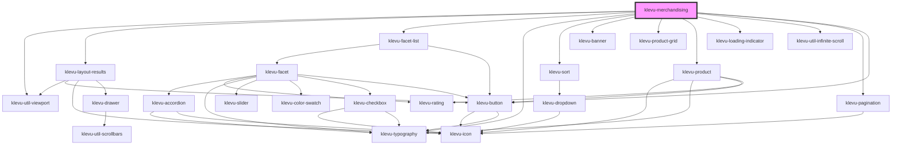

# klevu-merchandising

<!-- Auto Generated Below -->

## Overview

Full merchandising app to power up your product grid pages

## Properties

| Property                     | Attribute             | Description                                               | Type                                                                                                                                                                                                                                                                                                                                                    | Default                                     |
| ---------------------------- | --------------------- | --------------------------------------------------------- | ------------------------------------------------------------------------------------------------------------------------------------------------------------------------------------------------------------------------------------------------------------------------------------------------------------------------------------------------------- | ------------------------------------------- |
| `category` _(required)_      | `category`            | Which category products                                   | `string`                                                                                                                                                                                                                                                                                                                                                | `undefined`                                 |
| `categoryTitle` _(required)_ | `category-title`      | Category title                                            | `string`                                                                                                                                                                                                                                                                                                                                                | `undefined`                                 |
| `filterCount`                | `filter-count`        | How many filters per facet to show                        | `number \| undefined`                                                                                                                                                                                                                                                                                                                                   | `undefined`                                 |
| `filterCustomOrder`          | --                    | Order filters in given order                              | `undefined \| { [key: string]: string[]; }`                                                                                                                                                                                                                                                                                                             | `undefined`                                 |
| `limit`                      | `limit`               | Count of products for page                                | `number`                                                                                                                                                                                                                                                                                                                                                | `24`                                        |
| `options`                    | --                    | Object to override and settings on search options         | `undefined \| { id: string; searchTerm: string; } & Omit<KlevuBaseQuerySettings, "query">`                                                                                                                                                                                                                                                              | `undefined`                                 |
| `showRatings`                | `show-ratings`        | Show ratings                                              | `boolean \| undefined`                                                                                                                                                                                                                                                                                                                                  | `undefined`                                 |
| `showRatingsCount`           | `show-ratings-count`  | Show ratings count                                        | `boolean \| undefined`                                                                                                                                                                                                                                                                                                                                  | `undefined`                                 |
| `sort`                       | `sort`                | Order of results                                          | `KlevuSearchSorting.AdvancedSorting \| KlevuSearchSorting.NameAsc \| KlevuSearchSorting.NameDesc \| KlevuSearchSorting.NewArrivalAsc \| KlevuSearchSorting.NewArrivalDesc \| KlevuSearchSorting.PriceAsc \| KlevuSearchSorting.PriceDesc \| KlevuSearchSorting.RatingAsc \| KlevuSearchSorting.RatingDesc \| KlevuSearchSorting.Relevance \| undefined` | `undefined`                                 |
| `sortOptions`                | --                    | Pass custom options for the sort dropdown                 | `undefined \| { value: KlevuSearchSorting; text: string; }[]`                                                                                                                                                                                                                                                                                           | `undefined`                                 |
| `tLoadMore`                  | `t-load-more`         | Text for load more button                                 | `any`                                                                                                                                                                                                                                                                                                                                                   | `getTranslation("merchandising.tLoadMore")` |
| `useABTest`                  | `use-a-b-test`        | Overrides KMC setting to use ABtest for results           | `boolean \| undefined`                                                                                                                                                                                                                                                                                                                                  | `undefined`                                 |
| `useInfiniteScroll`          | `use-infinite-scroll` | Should use infinite scroll component to trigger load next | `boolean \| undefined`                                                                                                                                                                                                                                                                                                                                  | `undefined`                                 |
| `usePagination`              | `use-pagination`      | Should display pagination instead of load next            | `boolean \| undefined`                                                                                                                                                                                                                                                                                                                                  | `undefined`                                 |
| `usePersonalisation`         | `use-personalisation` | Enable personalisation                                    | `boolean \| undefined`                                                                                                                                                                                                                                                                                                                                  | `undefined`                                 |

## Events

| Event       | Description | Type                                                                                                       |
| ----------- | ----------- | ---------------------------------------------------------------------------------------------------------- |
| `klevuData` |             | `CustomEvent<{ resultObject: KlevuResponseQueryObject; records: KlevuRecord[]; manager: FilterManager; }>` |

## Slots

| Slot              | Description                                     |
| ----------------- | ----------------------------------------------- |
| `"bottombanners"` | Bottom banner content                           |
| `"content"`       | Product grid items including the grid container |
| `"facets"`        | Sidebar of facets content                       |
| `"footer"`        | Footer container                                |
| `"header"`        | Header container                                |
| `"topbanners"`    | Top banner content                              |

## Dependencies

### Depends on

- [klevu-util-viewport](../klevu-util-viewport)
- [klevu-layout-results](../klevu-layout-results)
- [klevu-facet-list](../klevu-facet-list)
- [klevu-typography](../klevu-typography)
- [klevu-sort](../klevu-sort)
- [klevu-banner](../klevu-banner)
- [klevu-product-grid](../klevu-product-grid)
- [klevu-product](../klevu-product)
- [klevu-loading-indicator](../klevu-loading-indicator)
- [klevu-util-infinite-scroll](../klevu-util-infinite-scroll)
- [klevu-pagination](../klevu-pagination)
- [klevu-button](../klevu-button)

### Graph

----------------------------------------------

*Built with [StencilJS](https://stenciljs.com/)*
