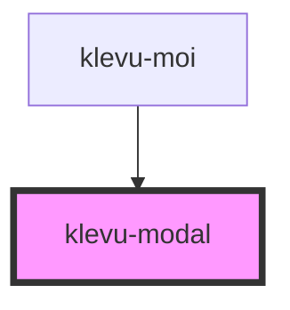

# klevu-modal

<!-- Auto Generated Below -->

## Overview

Stylized modal dialog.

## Properties

| Property    | Attribute    | Description                    | Type      | Default |
| ----------- | ------------ | ------------------------------ | --------- | ------- |
| `startOpen` | `start-open` | Should show the modal on load. | `boolean` | `false` |

## Events

| Event             | Description                       | Type                |
| ----------------- | --------------------------------- | ------------------- |
| `klevuCloseModal` | Emitted when the modal is closed. | `CustomEvent<void>` |

## Methods

### `closeModal() => Promise<void>`

Closes the modal.

#### Returns

Type: `Promise<void>`

### `openModal() => Promise<void>`

Opens the modal.

#### Returns

Type: `Promise<void>`

## Shadow Parts

| Part              | Description |
| ----------------- | ----------- |
| `"material-icon"` |             |

## Dependencies

### Used by

 - [klevu-moi](../klevu-moi)

### Graph

----------------------------------------------

