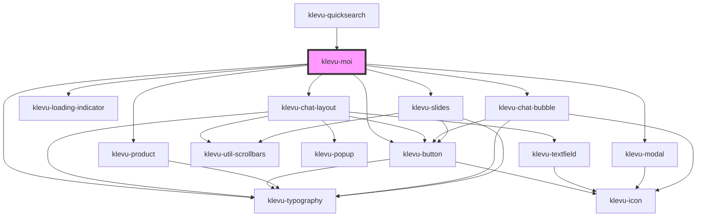

# klevu-moi

<!-- Auto Generated Below -->

## Overview

Klevu MOI Application

## Properties

| Property    | Attribute    | Description              | Type                  | Default     |
| ----------- | ------------ | ------------------------ | --------------------- | ----------- |
| `apiKey`    | `api-key`    | Override default API key | `string \| undefined` | `undefined` |
| `showClose` | `show-close` | Show close button        | `boolean`             | `false`     |

## Events

| Event                  | Description                                                                                                                                                     | Type                                                                                                                                                                                                                                                                                    |
| ---------------------- | --------------------------------------------------------------------------------------------------------------------------------------------------------------- | --------------------------------------------------------------------------------------------------------------------------------------------------------------------------------------------------------------------------------------------------------------------------------------- |
| `klevuMoiProductClick` | When a product is clicked. By default does a full page redirect to product url if event is not cancelled.  Use `event.preventDefault()` to cancel the redirect. | `CustomEvent<{ id: string; currency: string; image: string; itemGroupId: string; name: string; noOfVariants: number; options: { chat: string; intent: string; name: string; }[]; originalContent: string \| null; price: string; salePrice: string; shortDesc: string; url: string; }>` |

## Dependencies

### Used by

 - [klevu-quicksearch](../klevu-quicksearch)

### Depends on

- [klevu-chat-layout](../klevu-chat-layout)
- [klevu-loading-indicator](../klevu-loading-indicator)
- [klevu-button](../klevu-button)
- [klevu-modal](../klevu-modal)
- [klevu-product](../klevu-product)
- [klevu-chat-bubble](../klevu-chat-bubble)
- [klevu-typography](../klevu-typography)
- [klevu-slides](../klevu-slides)

### Graph

----------------------------------------------

