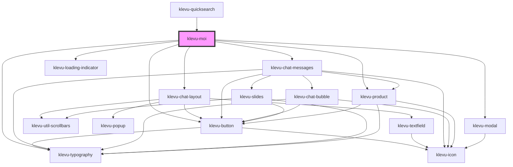

# klevu-moi

<!-- Auto Generated Below -->

## Overview

Klevu MOI Application

## Properties

| Property    | Attribute    | Description               | Type                   | Default     |
| ----------- | ------------ | ------------------------- | ---------------------- | ----------- |
| `apiKey`    | `api-key`    | Override default API key  | `string \| undefined`  | `undefined` |
| `startOpen` | `start-open` | Start the MOI window open | `boolean \| undefined` | `undefined` |

## Events

| Event                      | Description                                                                                                                                                     | Type                                                                                                                                                                                                                                                                                    |
| -------------------------- | --------------------------------------------------------------------------------------------------------------------------------------------------------------- | --------------------------------------------------------------------------------------------------------------------------------------------------------------------------------------------------------------------------------------------------------------------------------------- |
| `klevuMoiProductClick`     | When a product is clicked. By default does a full page redirect to product url if event is not cancelled.  Use `event.preventDefault()` to cancel the redirect. | `CustomEvent<{ id: string; currency: string; image: string; itemGroupId: string; name: string; noOfVariants: number; options: { chat: string; intent: string; name: string; }[]; originalContent: string \| null; price: string; salePrice: string; shortDesc: string; url: string; }>` |
| `klevuMoiVisibilityChange` | When the visibility of Moi window changes                                                                                                                       | `CustomEvent<"close" \| "open">`                                                                                                                                                                                                                                                        |

## Methods

### `close() => Promise<void>`

#### Returns

Type: `Promise<void>`

### `open() => Promise<void>`

Initialize the MOI session and open window

#### Returns

Type: `Promise<void>`

## Dependencies

### Used by

 - [klevu-quicksearch](../klevu-quicksearch)

### Depends on

- [klevu-chat-layout](../klevu-chat-layout)
- [klevu-typography](../klevu-typography)
- [klevu-button](../klevu-button)
- [klevu-chat-messages](../klevu-chat-messages)
- [klevu-loading-indicator](../klevu-loading-indicator)
- [klevu-modal](../klevu-modal)
- [klevu-product](../klevu-product)

### Graph

----------------------------------------------

