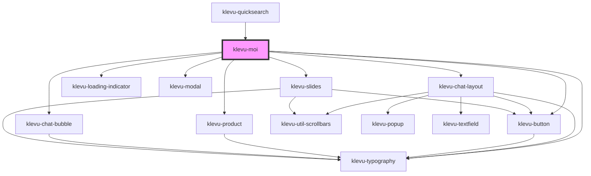

# klevu-moi

<!-- Auto Generated Below -->

## Overview

Klevu MOI Application

## Properties

| Property         | Attribute    | Description                                                                     | Type                                      | Default                                                                                                                                                                                  |
| ---------------- | ------------ | ------------------------------------------------------------------------------- | ----------------------------------------- | ---------------------------------------------------------------------------------------------------------------------------------------------------------------------------------------- |
| `apiKey`         | `api-key`    | Override default API key                                                        | `string \| undefined`                     | `undefined`                                                                                                                                                                              |
| `onProductClick` | --           | When a product is clicked. By default does a full page redirect to product url. | `(product: Partial<KlevuRecord>) => void` | `(product: Partial<KlevuRecord>) => {     if (!product.url) {       console.warn("No product url found. Cannot redirect")       return     }     window.location.href = product.url   }` |
| `showClose`      | `show-close` | Show close button                                                               | `boolean`                                 | `false`                                                                                                                                                                                  |

## Dependencies

### Used by

 - [klevu-quicksearch](../klevu-quicksearch)

### Depends on

- [klevu-chat-layout](../klevu-chat-layout)
- [klevu-loading-indicator](../klevu-loading-indicator)
- [klevu-button](../klevu-button)
- [klevu-modal](../klevu-modal)
- [klevu-product](../klevu-product)
- [klevu-chat-bubble](../klevu-chat-bubble)
- [klevu-typography](../klevu-typography)
- [klevu-slides](../klevu-slides)

### Graph

----------------------------------------------

