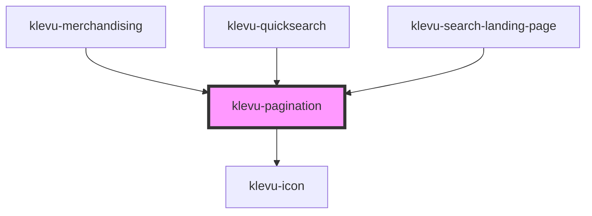

# klevu-pagination

<!-- Auto Generated Below -->

## Overview

Pagination component. Either provide numbers or query result to display the component.

## Properties

| Property      | Attribute | Description                                      | Type                                                                                                                                                                                                                                                                                                                                                                                                                                     | Default     |
| ------------- | --------- | ------------------------------------------------ | ---------------------------------------------------------------------------------------------------------------------------------------------------------------------------------------------------------------------------------------------------------------------------------------------------------------------------------------------------------------------------------------------------------------------------------------- | ----------- |
| `current`     | `current` | Current page                                     | `number \| undefined`                                                                                                                                                                                                                                                                                                                                                                                                                    | `undefined` |
| `max`         | `max`     | Max page                                         | `number \| undefined`                                                                                                                                                                                                                                                                                                                                                                                                                    | `undefined` |
| `min`         | `min`     | Min page                                         | `number \| undefined`                                                                                                                                                                                                                                                                                                                                                                                                                    | `undefined` |
| `queryResult` | --        | Query results used to build min, max and current | `undefined \| { id: string; filters?: (KlevuFilterResultOptions \| KlevuFilterResultSlider \| KlevuFilterResultRating)[] \| undefined; meta: { apiKey: string; isPersonalised: boolean; qTime: number; noOfResults: number; totalResultsFound: number; offset: number; typeOfSearch: KlevuTypeOfSearch; debuggingInformation: unknown; notificationCode: number; searchedTerm: string; }; records: ({ id: string; } & KlevuRecord)[]; }` | `undefined` |

## Events

| Event                   | Description                | Type                  |
| ----------------------- | -------------------------- | --------------------- |
| `klevuPaginationChange` | Page that was changed into | `CustomEvent<number>` |

## Dependencies

### Used by

 - [klevu-merchandising](../klevu-merchandising)
 - [klevu-quicksearch](../klevu-quicksearch)
 - [klevu-search-landing-page](../klevu-search-landing-page)

### Depends on

- [klevu-icon](../klevu-icon)

### Graph

----------------------------------------------

*Built with [StencilJS](https://stenciljs.com/)*
