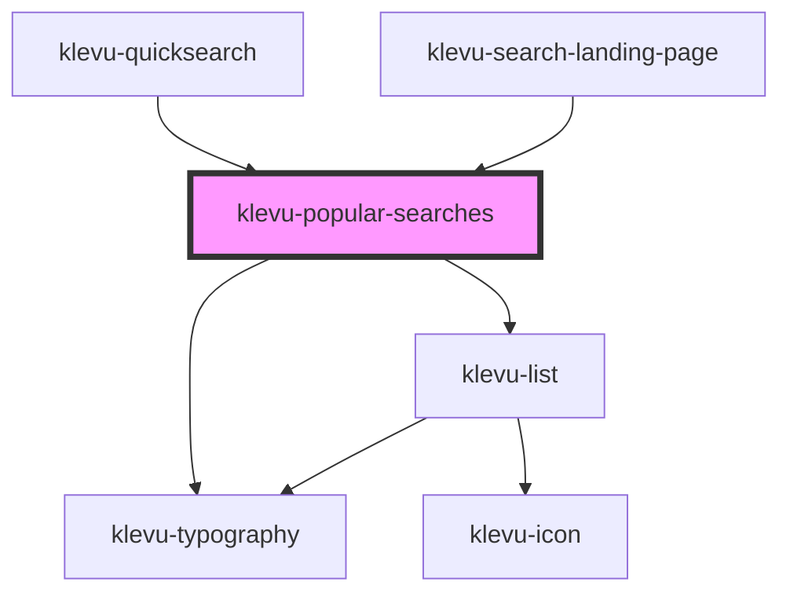

# klevu-popular-searches

<!-- Auto Generated Below -->

## Overview

Fetches and displays most popular searches from Klevu Merchant center

## Properties

| Property   | Attribute   | Description         | Type  | Default                                      |
| ---------- | ----------- | ------------------- | ----- | -------------------------------------------- |
| `tCaption` | `t-caption` | Caption of the list | `any` | `getTranslation("popularSearches.tCaption")` |

## Events

| Event                       | Description                                            | Type                  |
| --------------------------- | ------------------------------------------------------ | --------------------- |
| `klevuPopularSearchClicked` | Event that is emitted when a popular search is clicked | `CustomEvent<string>` |

## Dependencies

### Used by

 - [klevu-quicksearch](../klevu-quicksearch)
 - [klevu-search-landing-page](../klevu-search-landing-page)

### Depends on

- [klevu-typography](../klevu-typography)
- [klevu-list](../klevu-list)

### Graph

----------------------------------------------

*Built with [StencilJS](https://stenciljs.com/)*
