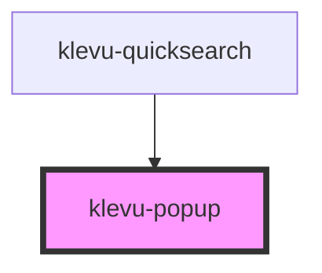

# klevu-popup

<!-- Auto Generated Below -->

## Properties

| Property              | Attribute                | Description | Type      | Default |
| --------------------- | ------------------------ | ----------- | --------- | ------- |
| `closeAtOutsideClick` | `close-at-outside-click` |             | `boolean` | `true`  |
| `fullwidthContent`    | `fullwidth-content`      |             | `boolean` | `false` |
| `open`                | `open`                   |             | `boolean` | `false` |
| `openAtFocus`         | `open-at-focus`          |             | `boolean` | `true`  |

## Dependencies

### Used by

 - [klevu-quicksearch](../klevu-quicksearch)

### Graph

----------------------------------------------

*Built with [StencilJS](https://stenciljs.com/)*
