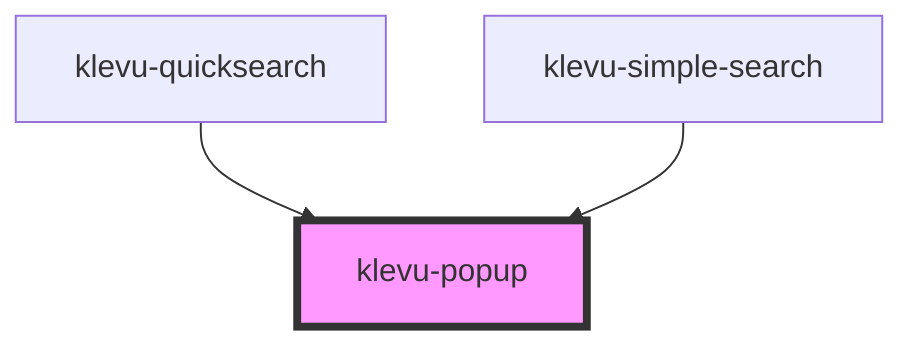

# klevu-popup

<!-- Auto Generated Below -->

## Properties

| Property              | Attribute                | Description                                                | Type                   | Default     |
| --------------------- | ------------------------ | ---------------------------------------------------------- | ---------------------- | ----------- |
| `anchor`              | `anchor`                 | Anchor popup to left or right of page                      | `"left" \| "right"`    | `"right"`   |
| `closeAtOutsideClick` | `close-at-outside-click` | Close popup when clicking outside content area             | `boolean`              | `true`      |
| `fullwidthContent`    | `fullwidth-content`      | At minimum popup content should be the widht of the origin | `boolean`              | `false`     |
| `openAtFocus`         | `open-at-focus`          | Open content when origin component is focused              | `boolean`              | `true`      |
| `startOpen`           | `start-open`             | Initially show the popup                                   | `boolean \| undefined` | `undefined` |

## Methods

### `closeModal() => Promise<void>`

Closes the popup

#### Returns

Type: `Promise<void>`

### `openModal() => Promise<void>`

Opens the popup

#### Returns

Type: `Promise<void>`

## Slots

| Slot        | Description                               |
| ----------- | ----------------------------------------- |
| `"content"` | Content of the popup                      |
| `"origin"`  | Popoup origin that opens content of popup |

## Dependencies

### Used by

 - [klevu-quicksearch](../klevu-quicksearch)
 - [klevu-simple-search](../klevu-simple-search)

### Graph

----------------------------------------------

*Built with [StencilJS](https://stenciljs.com/)*
