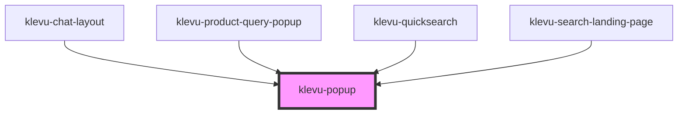

# klevu-popup

<!-- Auto Generated Below -->

## Overview

Popup component where clicking origin component popups the the content

## Properties

| Property                 | Attribute                   | Description                                                                        | Type                                                                                                                                                                 | Default      |
| ------------------------ | --------------------------- | ---------------------------------------------------------------------------------- | -------------------------------------------------------------------------------------------------------------------------------------------------------------------- | ------------ |
| `anchor`                 | `anchor`                    | Anchor popup to left or right of page                                              | `"bottom" \| "bottom-end" \| "bottom-start" \| "left" \| "left-end" \| "left-start" \| "right" \| "right-end" \| "right-start" \| "top" \| "top-end" \| "top-start"` | `"left-end"` |
| `closeAtOutsideClick`    | `close-at-outside-click`    | Close popup when clicking outside content area                                     | `boolean`                                                                                                                                                            | `true`       |
| `elevation`              | `elevation`                 | Elevation of the popup. 0-3.                                                       | `number`                                                                                                                                                             | `1`          |
| `fullscreenOnMobileSize` | `fullscreen-on-mobile-size` | Expand popup to full size of the screen when popup is smaller that requested width | `boolean \| undefined`                                                                                                                                               | `undefined`  |
| `offset`                 | `offset`                    | How many pixels to offset the popup from origin                                    | `number`                                                                                                                                                             | `16`         |
| `openAtFocus`            | `open-at-focus`             | Open content when origin component is focused                                      | `boolean`                                                                                                                                                            | `true`       |
| `originElement`          | --                          | Element to anchor popup to. If not set popup is anchored to origin slot            | `HTMLElement \| undefined`                                                                                                                                           | `undefined`  |
| `popupWidth`             | `popup-width`               | Set width of the popup content                                                     | `number \| undefined`                                                                                                                                                | `undefined`  |
| `startOpen`              | `start-open`                | Initially show the popup                                                           | `boolean \| undefined`                                                                                                                                               | `undefined`  |
| `toggle`                 | `toggle`                    | Clicking origin again will close the popup                                         | `boolean \| undefined`                                                                                                                                               | `undefined`  |
| `useBackground`          | `use-background`            | Darken background when popup is open                                               | `boolean`                                                                                                                                                            | `false`      |

## Events

| Event             | Description                                | Type                |
| ----------------- | ------------------------------------------ | ------------------- |
| `klevuPopupClose` |                                            | `CustomEvent<void>` |
| `klevuPopupOpen`  | When popup is opened this event is emitted | `CustomEvent<void>` |

## Methods

### `closeModal() => Promise<void>`

Closes the popup

#### Returns

Type: `Promise<void>`

### `openModal() => Promise<void>`

Opens the popup

#### Returns

Type: `Promise<void>`

## Slots

| Slot        | Description                               |
| ----------- | ----------------------------------------- |
| `"content"` | Content of the popup                      |
| `"origin"`  | Popoup origin that opens content of popup |

## Shadow Parts

| Part              | Description |
| ----------------- | ----------- |
| `"popup-content"` |             |
| `"popup-origin"`  |             |

## Dependencies

### Used by

 - [klevu-chat-layout](../klevu-chat-layout)
 - [klevu-product-query-popup](../klevu-product-query-popup)
 - [klevu-quicksearch](../klevu-quicksearch)
 - [klevu-search-landing-page](../klevu-search-landing-page)

### Graph

----------------------------------------------

