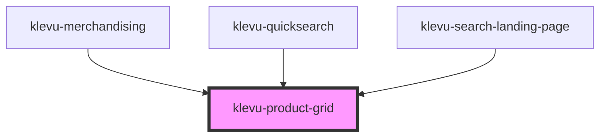

# klevu-product-grid

<!-- Auto Generated Below -->

## Overview

Component to place products on grid. Very simple container for products.

## Properties

| Property      | Attribute       | Description                                                   | Type                  | Default     |
| ------------- | --------------- | ------------------------------------------------------------- | --------------------- | ----------- |
| `itemsPerRow` | `items-per-row` | Force to place products in grid with given number of columns. | `number \| undefined` | `undefined` |

## Dependencies

### Used by

 - [klevu-merchandising](../klevu-merchandising)
 - [klevu-quicksearch](../klevu-quicksearch)
 - [klevu-search-landing-page](../klevu-search-landing-page)

### Graph

----------------------------------------------

*Built with [StencilJS](https://stenciljs.com/)*
