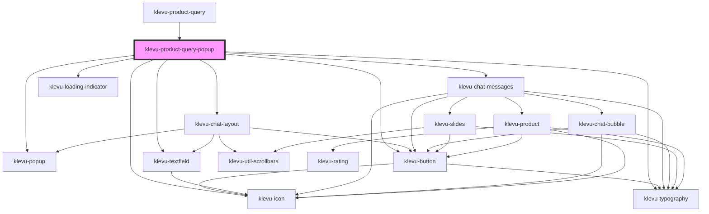

# klevu-product-query

<!-- Auto Generated Below -->

## Overview

Klevu Product Query popup application that shows a popup for asking questions about a product

## Properties

| Property                   | Attribute                     | Description                                                                         | Type                                                                                                                                                                                                                                                                                                                                                                                                                                                                                                                                                                                                                                                                                                                                                                                                                                                                                                                                                                                                                                                                                                                                                                                                                                                                                                                                           | Default                                                     |
| -------------------------- | ----------------------------- | ----------------------------------------------------------------------------------- | ---------------------------------------------------------------------------------------------------------------------------------------------------------------------------------------------------------------------------------------------------------------------------------------------------------------------------------------------------------------------------------------------------------------------------------------------------------------------------------------------------------------------------------------------------------------------------------------------------------------------------------------------------------------------------------------------------------------------------------------------------------------------------------------------------------------------------------------------------------------------------------------------------------------------------------------------------------------------------------------------------------------------------------------------------------------------------------------------------------------------------------------------------------------------------------------------------------------------------------------------------------------------------------------------------------------------------------------------- | ----------------------------------------------------------- |
| `askButtonText`            | `ask-button-text`             | Text of the button for asking a question                                            | `string \| undefined`                                                                                                                                                                                                                                                                                                                                                                                                                                                                                                                                                                                                                                                                                                                                                                                                                                                                                                                                                                                                                                                                                                                                                                                                                                                                                                                          | `undefined`                                                 |
| `config`                   | --                            | Config for Klevu                                                                    | `KlevuConfig \| undefined`                                                                                                                                                                                                                                                                                                                                                                                                                                                                                                                                                                                                                                                                                                                                                                                                                                                                                                                                                                                                                                                                                                                                                                                                                                                                                                                     | `undefined`                                                 |
| `disableCloseOutsideClick` | `disable-close-outside-click` | Disable closing the popup when clicking outside of it                               | `boolean \| undefined`                                                                                                                                                                                                                                                                                                                                                                                                                                                                                                                                                                                                                                                                                                                                                                                                                                                                                                                                                                                                                                                                                                                                                                                                                                                                                                                         | `undefined`                                                 |
| `originElement`            | --                            | Element to anchor the product query popup to                                        | `HTMLElement \| undefined`                                                                                                                                                                                                                                                                                                                                                                                                                                                                                                                                                                                                                                                                                                                                                                                                                                                                                                                                                                                                                                                                                                                                                                                                                                                                                                                     | `undefined`                                                 |
| `popupAnchor`              | `popup-anchor`                | Anchor popup to which side of the origin                                            | `"bottom" \| "bottom-end" \| "bottom-start" \| "left" \| "left-end" \| "left-start" \| "right" \| "right-end" \| "right-start" \| "top" \| "top-end" \| "top-start"`                                                                                                                                                                                                                                                                                                                                                                                                                                                                                                                                                                                                                                                                                                                                                                                                                                                                                                                                                                                                                                                                                                                                                                           | `"bottom-start"`                                            |
| `popupOffset`              | `popup-offset`                | How many pixels to offset the popup from origin                                     | `number \| undefined`                                                                                                                                                                                                                                                                                                                                                                                                                                                                                                                                                                                                                                                                                                                                                                                                                                                                                                                                                                                                                                                                                                                                                                                                                                                                                                                          | `undefined`                                                 |
| `pqaWidgetId`              | `pqa-widget-id`               | Instead of Klevu API-key use a widget id to start a session                         | `string \| undefined`                                                                                                                                                                                                                                                                                                                                                                                                                                                                                                                                                                                                                                                                                                                                                                                                                                                                                                                                                                                                                                                                                                                                                                                                                                                                                                                          | `undefined`                                                 |
| `productId`                | `product-id`                  | Alternative to url, productId can be used to start a session                        | `string \| undefined`                                                                                                                                                                                                                                                                                                                                                                                                                                                                                                                                                                                                                                                                                                                                                                                                                                                                                                                                                                                                                                                                                                                                                                                                                                                                                                                          | `undefined`                                                 |
| `settings`                 | --                            | Settings for requests to Klevu. Deeper modification on how the product query works. | `undefined \| { groupBy?: "name" \| "id" \| undefined; typeOfRecords?: KlevuAnyTypeOfRecord[] \| undefined; fields?: KlevuRecordFields[] \| undefined; sort?: KlevuSearchSorting \| undefined; advancedSorting?: { type: "FIELD"; key: string; order: AdvancedSortingDiretion; }[] \| undefined; limit?: number \| undefined; offset?: number \| undefined; typeOfSearch?: KlevuTypeOfSearch \| undefined; searchPrefs?: KlevuSearchPreference[] \| undefined; fallbackQueryId?: string \| undefined; fallbackWhenCountLessThan?: number \| undefined; topIds?: { key: string; value: string; }[] \| undefined; includeIds?: { key: string; value: string; }[] \| undefined; excludeIds?: { key: string; value: string; }[] \| undefined; customANDQuery?: string \| undefined; personalisation?: { enablePersonalisation: true; fields?: KlevuRecordFields[] \| undefined; } \| undefined; context?: { recentObjects?: { typeOfRecord: KlevuAnyTypeOfRecord; records: { id: string; }[]; }[] \| undefined; sourceObjects?: { typeOfRecord: KlevuAnyTypeOfRecord; records: ({ itemGroupId: string; } \| { id: string; })[]; }[] \| undefined; } \| undefined; priceFieldSuffix?: string \| undefined; visibilityGroupID?: string \| undefined; campaignForCatNav?: string \| undefined; groupCondition?: KlevuGroupConditions \| undefined; }` | `undefined`                                                 |
| `tButtonText`              | `t-button-text`               | Text of the button to open the popup                                                | `any`                                                                                                                                                                                                                                                                                                                                                                                                                                                                                                                                                                                                                                                                                                                                                                                                                                                                                                                                                                                                                                                                                                                                                                                                                                                                                                                                          | `getTranslation("productQueryPopup.tButtonText")`           |
| `tDataProtectionNotice`    | `t-data-protection-notice`    | Data protection notice when user registering is enabled                             | `any`                                                                                                                                                                                                                                                                                                                                                                                                                                                                                                                                                                                                                                                                                                                                                                                                                                                                                                                                                                                                                                                                                                                                                                                                                                                                                                                                          | `getTranslation("productQueryPopup.tDataProtectionNotice")` |
| `tFinePrint`               | `t-fine-print`                | Fine print of the popup under the title                                             | `any`                                                                                                                                                                                                                                                                                                                                                                                                                                                                                                                                                                                                                                                                                                                                                                                                                                                                                                                                                                                                                                                                                                                                                                                                                                                                                                                                          | `getTranslation("productQueryPopup.tFinePrint")`            |
| `tLoadingSorry`            | `t-loading-sorry`             | When loading takes a bit longer, show this text                                     | `any`                                                                                                                                                                                                                                                                                                                                                                                                                                                                                                                                                                                                                                                                                                                                                                                                                                                                                                                                                                                                                                                                                                                                                                                                                                                                                                                                          | `getTranslation("productQueryPopup.tLoadingSorry")`         |
| `tPopupTitle`              | `t-popup-title`               | Title of the popup                                                                  | `any`                                                                                                                                                                                                                                                                                                                                                                                                                                                                                                                                                                                                                                                                                                                                                                                                                                                                                                                                                                                                                                                                                                                                                                                                                                                                                                                                          | `getTranslation("productQueryPopup.tPopuptitle")`           |
| `tRateExperienceText`      | `t-rate-experience-text`      | Description of the feedback section when closing the popup                          | `any`                                                                                                                                                                                                                                                                                                                                                                                                                                                                                                                                                                                                                                                                                                                                                                                                                                                                                                                                                                                                                                                                                                                                                                                                                                                                                                                                          | `getTranslation("productQueryPopup.tRateExperienceText")`   |
| `tRateExperienceTitle`     | `t-rate-experience-title`     | Title of the feedback section when closing the popup                                | `any`                                                                                                                                                                                                                                                                                                                                                                                                                                                                                                                                                                                                                                                                                                                                                                                                                                                                                                                                                                                                                                                                                                                                                                                                                                                                                                                                          | `getTranslation("productQueryPopup.tRateExperienceTitle")`  |
| `tTextFieldPlaceholder`    | `t-text-field-placeholder`    | Placeholder of the textfield                                                        | `any`                                                                                                                                                                                                                                                                                                                                                                                                                                                                                                                                                                                                                                                                                                                                                                                                                                                                                                                                                                                                                                                                                                                                                                                                                                                                                                                                          | `getTranslation("productQueryPopup.tTextFieldPlaceholder")` |
| `textFieldVariant`         | `text-field-variant`          | Variant of the textfield how does it look like                                      | `"default" \| "pill"`                                                                                                                                                                                                                                                                                                                                                                                                                                                                                                                                                                                                                                                                                                                                                                                                                                                                                                                                                                                                                                                                                                                                                                                                                                                                                                                          | `"pill"`                                                    |
| `url`                      | `url`                         | Url of the page where the product is                                                | `string`                                                                                                                                                                                                                                                                                                                                                                                                                                                                                                                                                                                                                                                                                                                                                                                                                                                                                                                                                                                                                                                                                                                                                                                                                                                                                                                                       | `""`                                                        |
| `useBackground`            | `use-background`              | Use dark background with the popup                                                  | `boolean \| undefined`                                                                                                                                                                                                                                                                                                                                                                                                                                                                                                                                                                                                                                                                                                                                                                                                                                                                                                                                                                                                                                                                                                                                                                                                                                                                                                                         | `undefined`                                                 |

## Slots

| Slot          | Description             |
| ------------- | ----------------------- |
| `"fineprint"` | Fine print of the popup |

## Dependencies

### Used by

 - [klevu-product-query](../klevu-product-query)

### Depends on

- [klevu-popup](../klevu-popup)
- [klevu-chat-layout](../klevu-chat-layout)
- [klevu-typography](../klevu-typography)
- [klevu-icon](../klevu-icon)
- [klevu-chat-messages](../klevu-chat-messages)
- [klevu-loading-indicator](../klevu-loading-indicator)
- [klevu-textfield](../klevu-textfield)
- [klevu-button](../klevu-button)

### Graph

----------------------------------------------

