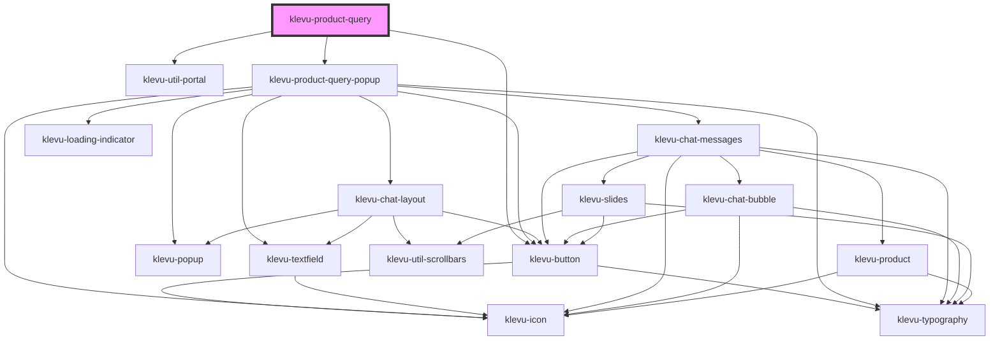

# klevu-product-query-button

<!-- Auto Generated Below -->

## Overview

Button that is placed on the site to start a product query session

## Properties

| Property                   | Attribute                     | Description                                                                         | Type                                                                                                                                                                                                                                                                                                                                                                                                                                                                                                                                                                                                                                                                                                                                                                                                                                                                                                                                                                                                                                                                                                                                                                                                                                                                                                                                           | Default                                                                                         |
| -------------------------- | ----------------------------- | ----------------------------------------------------------------------------------- | ---------------------------------------------------------------------------------------------------------------------------------------------------------------------------------------------------------------------------------------------------------------------------------------------------------------------------------------------------------------------------------------------------------------------------------------------------------------------------------------------------------------------------------------------------------------------------------------------------------------------------------------------------------------------------------------------------------------------------------------------------------------------------------------------------------------------------------------------------------------------------------------------------------------------------------------------------------------------------------------------------------------------------------------------------------------------------------------------------------------------------------------------------------------------------------------------------------------------------------------------------------------------------------------------------------------------------------------------- | ----------------------------------------------------------------------------------------------- |
| `askButtonText`            | `ask-button-text`             | Text of the button for asking a question                                            | `string \| undefined`                                                                                                                                                                                                                                                                                                                                                                                                                                                                                                                                                                                                                                                                                                                                                                                                                                                                                                                                                                                                                                                                                                                                                                                                                                                                                                                          | `undefined`                                                                                     |
| `buttonText`               | `button-text`                 | Text of the button to open the popup                                                | `string`                                                                                                                                                                                                                                                                                                                                                                                                                                                                                                                                                                                                                                                                                                                                                                                                                                                                                                                                                                                                                                                                                                                                                                                                                                                                                                                                       | `"Ask a Question"`                                                                              |
| `disableCloseOutsideClick` | `disable-close-outside-click` | Disable closing the popup when clicking outside of it                               | `boolean \| undefined`                                                                                                                                                                                                                                                                                                                                                                                                                                                                                                                                                                                                                                                                                                                                                                                                                                                                                                                                                                                                                                                                                                                                                                                                                                                                                                                         | `undefined`                                                                                     |
| `finePrint`                | `fine-print`                  | Fine print of the popup under the title                                             | `string`                                                                                                                                                                                                                                                                                                                                                                                                                                                                                                                                                                                                                                                                                                                                                                                                                                                                                                                                                                                                                                                                                                                                                                                                                                                                                                                                       | `"I'm an AI model. Sometimes, I may make mistakes. Please verify answers on the product page."` |
| `popupAnchor`              | `popup-anchor`                | Anchor popup to which side of the origin                                            | `"bottom" \| "bottom-end" \| "bottom-start" \| "left" \| "left-end" \| "left-start" \| "right" \| "right-end" \| "right-start" \| "top" \| "top-end" \| "top-start"`                                                                                                                                                                                                                                                                                                                                                                                                                                                                                                                                                                                                                                                                                                                                                                                                                                                                                                                                                                                                                                                                                                                                                                           | `"bottom-start"`                                                                                |
| `popupOffset`              | `popup-offset`                | How many pixels to offset the popup from origin                                     | `number \| undefined`                                                                                                                                                                                                                                                                                                                                                                                                                                                                                                                                                                                                                                                                                                                                                                                                                                                                                                                                                                                                                                                                                                                                                                                                                                                                                                                          | `undefined`                                                                                     |
| `popupTitle`               | `popup-title`                 | Title of the popup                                                                  | `string`                                                                                                                                                                                                                                                                                                                                                                                                                                                                                                                                                                                                                                                                                                                                                                                                                                                                                                                                                                                                                                                                                                                                                                                                                                                                                                                                       | `"Ask a Question"`                                                                              |
| `pqaWidgetId`              | `pqa-widget-id`               | Instead of Klevu API-key use a widget id to start a session                         | `string \| undefined`                                                                                                                                                                                                                                                                                                                                                                                                                                                                                                                                                                                                                                                                                                                                                                                                                                                                                                                                                                                                                                                                                                                                                                                                                                                                                                                          | `undefined`                                                                                     |
| `productId`                | `product-id`                  | Alternative to url, productId can be used to start a session                        | `string \| undefined`                                                                                                                                                                                                                                                                                                                                                                                                                                                                                                                                                                                                                                                                                                                                                                                                                                                                                                                                                                                                                                                                                                                                                                                                                                                                                                                          | `undefined`                                                                                     |
| `settings`                 | --                            | Settings for requests to Klevu. Deeper modification on how the product query works. | `undefined \| { groupBy?: "name" \| "id" \| undefined; typeOfRecords?: KlevuAnyTypeOfRecord[] \| undefined; fields?: KlevuRecordFields[] \| undefined; sort?: KlevuSearchSorting \| undefined; advancedSorting?: { type: "FIELD"; key: string; order: AdvancedSortingDiretion; }[] \| undefined; limit?: number \| undefined; offset?: number \| undefined; typeOfSearch?: KlevuTypeOfSearch \| undefined; searchPrefs?: KlevuSearchPreference[] \| undefined; fallbackQueryId?: string \| undefined; fallbackWhenCountLessThan?: number \| undefined; topIds?: { key: string; value: string; }[] \| undefined; includeIds?: { key: string; value: string; }[] \| undefined; excludeIds?: { key: string; value: string; }[] \| undefined; customANDQuery?: string \| undefined; personalisation?: { enablePersonalisation: true; fields?: KlevuRecordFields[] \| undefined; } \| undefined; context?: { recentObjects?: { typeOfRecord: KlevuAnyTypeOfRecord; records: { id: string; }[]; }[] \| undefined; sourceObjects?: { typeOfRecord: KlevuAnyTypeOfRecord; records: ({ itemGroupId: string; } \| { id: string; })[]; }[] \| undefined; } \| undefined; priceFieldSuffix?: string \| undefined; visibilityGroupID?: string \| undefined; campaignForCatNav?: string \| undefined; groupCondition?: KlevuGroupConditions \| undefined; }` | `undefined`                                                                                     |
| `textFieldPlaceholder`     | `text-field-placeholder`      | Placeholder of the textfield                                                        | `string`                                                                                                                                                                                                                                                                                                                                                                                                                                                                                                                                                                                                                                                                                                                                                                                                                                                                                                                                                                                                                                                                                                                                                                                                                                                                                                                                       | `"Ask a questions"`                                                                             |
| `textFieldVariant`         | `text-field-variant`          | Variant of the textfield how does it look like                                      | `"default" \| "pill"`                                                                                                                                                                                                                                                                                                                                                                                                                                                                                                                                                                                                                                                                                                                                                                                                                                                                                                                                                                                                                                                                                                                                                                                                                                                                                                                          | `"pill"`                                                                                        |
| `url`                      | `url`                         | Url of the page where the product is                                                | `string`                                                                                                                                                                                                                                                                                                                                                                                                                                                                                                                                                                                                                                                                                                                                                                                                                                                                                                                                                                                                                                                                                                                                                                                                                                                                                                                                       | `""`                                                                                            |
| `useBackground`            | `use-background`              | Use dark background with the popup                                                  | `boolean \| undefined`                                                                                                                                                                                                                                                                                                                                                                                                                                                                                                                                                                                                                                                                                                                                                                                                                                                                                                                                                                                                                                                                                                                                                                                                                                                                                                                         | `undefined`                                                                                     |

## Slots

| Slot                   | Description                  |
| ---------------------- | ---------------------------- |
| `"after-button-text"`  | After origin button text     |
| `"after-fineprint"`    | After fineprint in the popup |
| `"before-button-text"` | Before origin button text    |

## Shadow Parts

| Part                        | Description |
| --------------------------- | ----------- |
| `"klevu-query-open-button"` |             |

## Dependencies

### Depends on

- [klevu-button](../klevu-button)
- [klevu-util-portal](../klevu-util-portal)
- [klevu-product-query-popup](../klevu-product-query-popup)

### Graph

----------------------------------------------

