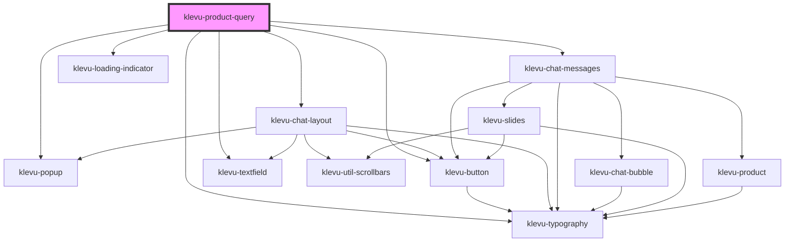

# klevu-product-query

<!-- Auto Generated Below -->

## Properties

| Property               | Attribute                | Description                                                  | Type                   | Default                                                                                  |
| ---------------------- | ------------------------ | ------------------------------------------------------------ | ---------------------- | ---------------------------------------------------------------------------------------- |
| `askButtonText`        | `ask-button-text`        | Text of the button for asking a question                     | `string \| undefined`  | `undefined`                                                                              |
| `buttonText`           | `button-text`            | Text of the button to open the popup                         | `string`               | `"Ask a Question"`                                                                       |
| `finePrint`            | `fine-print`             | Fine print of the popup under the title                      | `string`               | `"I'm an AI model. Sometimes, I may make mistakes. Please verify answers on this page."` |
| `productId`            | `product-id`             | Alternative to url, productId can be used to start a session | `string \| undefined`  | `undefined`                                                                              |
| `textFieldPlaceholder` | `text-field-placeholder` | Placeholder of the textfield                                 | `string`               | `"Ask a question"`                                                                       |
| `textFieldVariant`     | `text-field-variant`     | Variant of the textfield how does it look like               | `"default" \| "pill"`  | `"pill"`                                                                                 |
| `title`                | `title`                  | Title of the popup                                           | `string`               | `"Ask a Question"`                                                                       |
| `url`                  | `url`                    | Url of the page where the product is                         | `string`               | `""`                                                                                     |
| `useBackground`        | `use-background`         | Use dark background with the popup                           | `boolean \| undefined` | `undefined`                                                                              |

## Shadow Parts

| Part              | Description |
| ----------------- | ----------- |
| `"material-icon"` |             |

## Dependencies

### Depends on

- [klevu-popup](../klevu-popup)
- [klevu-button](../klevu-button)
- [klevu-typography](../klevu-typography)
- [klevu-chat-layout](../klevu-chat-layout)
- [klevu-chat-messages](../klevu-chat-messages)
- [klevu-loading-indicator](../klevu-loading-indicator)
- [klevu-textfield](../klevu-textfield)

### Graph

----------------------------------------------

