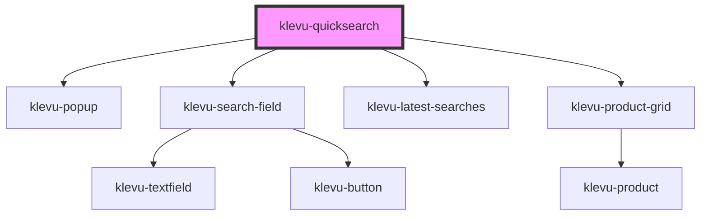

# klevu-quicksearch

<!-- Auto Generated Below -->

## Properties

| Property        | Attribute       | Description | Type                                    | Default     |
| --------------- | --------------- | ----------- | --------------------------------------- | ----------- |
| `fallbackTerm`  | `fallback-term` |             | `string`                                | `undefined` |
| `renderProduct` | --              |             | `(product: KlevuRecord) => HTMLElement` | `undefined` |

## Shadow Parts

| Part           | Description |
| -------------- | ----------- |
| `"klevu-list"` |             |

## Dependencies

### Depends on

- [klevu-popup](../klevu-popup)
- [klevu-search-field](../klevu-search-field)
- [klevu-latest-searches](../klevu-latest-searches)
- [klevu-product-grid](../klevu-product-grid)

### Graph

----------------------------------------------

*Built with [StencilJS](https://stenciljs.com/)*
