# klevu-quicksearch

<!-- Auto Generated Below -->

## Overview

Full app to create search bar that popups trending products and search results.

## Properties

| Property                               | Attribute                                     | Description                                                                                                                                                            | Type                                                                                                                                                                              | Default                                            |
| -------------------------------------- | --------------------------------------------- | ---------------------------------------------------------------------------------------------------------------------------------------------------------------------- | --------------------------------------------------------------------------------------------------------------------------------------------------------------------------------- | -------------------------------------------------- |
| `enableChat`                           | `enable-chat`                                 | Enable Klevu MOI chat                                                                                                                                                  | `boolean \| undefined`                                                                                                                                                            | `undefined`                                        |
| `fallbackTerm`                         | `fallback-term`                               | What term should be used if there isn't enough results                                                                                                                 | `string \| undefined`                                                                                                                                                             | `undefined`                                        |
| `fullResultCount`                      | `full-result-count`                           | How many products to show in full variant                                                                                                                              | `number`                                                                                                                                                                          | `9`                                                |
| `placeholder`                          | `placeholder`                                 | Placeholder for input text                                                                                                                                             | `string \| undefined`                                                                                                                                                             | `undefined`                                        |
| `popupAnchor`                          | `popup-anchor`                                | Anchor popup to witch side                                                                                                                                             | `"bottom" \| "bottom-end" \| "bottom-start" \| "left" \| "left-end" \| "left-start" \| "right" \| "right-end" \| "right-start" \| "top" \| "top-end" \| "top-start" \| undefined` | `"bottom-end"`                                     |
| `resultVariant`                        | `result-variant`                              | Change variant of the search results                                                                                                                                   | `"full" \| "simple"`                                                                                                                                                              | `"simple"`                                         |
| `searchCategories`                     | `search-categories`                           | Should component search for categories too                                                                                                                             | `boolean \| undefined`                                                                                                                                                            | `undefined`                                        |
| `searchCmsPages`                       | `search-cms-pages`                            | Should component search for CMS pages too                                                                                                                              | `boolean \| undefined`                                                                                                                                                            | `undefined`                                        |
| `searchFieldVariant`                   | `search-field-variant`                        | Change variant of the search field                                                                                                                                     | `"default" \| "pill"`                                                                                                                                                             | `"pill"`                                           |
| `searchText`                           | `search-text`                                 | Text of search button                                                                                                                                                  | `string \| undefined`                                                                                                                                                             | `undefined`                                        |
| `showPopularKeywordsOnNoResultsPage`   | `show-popular-keywords-on-no-results-page`    | Show popular keywords on no results page                                                                                                                               | `boolean \| undefined`                                                                                                                                                            | `undefined`                                        |
| `showPopularSearches`                  | `show-popular-searches`                       | Show popular keywords                                                                                                                                                  | `boolean \| undefined`                                                                                                                                                            | `undefined`                                        |
| `showRatings`                          | `show-ratings`                                | Show ratings                                                                                                                                                           | `boolean \| undefined`                                                                                                                                                            | `undefined`                                        |
| `showRatingsCount`                     | `show-ratings-count`                          | Show ratings count                                                                                                                                                     | `boolean \| undefined`                                                                                                                                                            | `undefined`                                        |
| `showRecentSearches`                   | `show-recent-searches`                        | Show recent searches                                                                                                                                                   | `boolean \| undefined`                                                                                                                                                            | `undefined`                                        |
| `showRecentlyViewedProducts`           | `show-recently-viewed-products`               | Show recently viewed products                                                                                                                                          | `boolean \| undefined`                                                                                                                                                            | `undefined`                                        |
| `showTrendingProducts`                 | `show-trending-products`                      | Show trending products                                                                                                                                                 | `boolean \| undefined`                                                                                                                                                            | `undefined`                                        |
| `showTrendingProductsOnNoResultsPage`  | `show-trending-products-on-no-results-page`   | Show trending products on no results page                                                                                                                              | `boolean \| undefined`                                                                                                                                                            | `undefined`                                        |
| `simpleResultCount`                    | `simple-result-count`                         | How many products to show in simple variant                                                                                                                            | `number`                                                                                                                                                                          | `3`                                                |
| `tCategoriesCaption`                   | `t-categories-caption`                        | Title of categories section                                                                                                                                            | `any`                                                                                                                                                                             | `getTranslation("quicksearch.tCategoriesCaption")` |
| `tLastClickedProductsCaption`          | `t-last-clicked-products-caption`             | Recently clicked tab caption Supports showing the count in place of %s in the value eg: `Recently Searched (%s)` with count of 2 will lead to `Recently Searched (2)`. | `string \| undefined`                                                                                                                                                             | `undefined`                                        |
| `tPopularProductsTitle`                | `t-popular-products-title`                    | Popular products section heading                                                                                                                                       | `string \| undefined`                                                                                                                                                             | `undefined`                                        |
| `tPopularProductsTitleOnNoResultsPage` | `t-popular-products-title-on-no-results-page` | Popular products section heading shown on no results page                                                                                                              | `string \| undefined`                                                                                                                                                             | `undefined`                                        |
| `tSearchResults`                       | `t-search-results`                            | Title of search results                                                                                                                                                | `any`                                                                                                                                                                             | `getTranslation("quicksearch.tSearchResults")`     |
| `tStartChat`                           | `t-start-chat`                                | Title of button to start Moi session                                                                                                                                   | `any`                                                                                                                                                                             | `getTranslation("quicksearch.tStartChat")`         |
| `tTrendingCaption`                     | `t-trending-caption`                          | Trending tab caption Supports showing the count in place of %s in the value eg: `Trending (%s)` with count of 2 will lead to `Trending (2)`.                           | `string \| undefined`                                                                                                                                                             | `undefined`                                        |
| `usePersonalisation`                   | `use-personalisation`                         | Enable personalisation                                                                                                                                                 | `boolean \| undefined`                                                                                                                                                            | `undefined`                                        |

## Events

| Event       | Description                                                                                                                          | Type                                                                                                                                                              |
| ----------- | ------------------------------------------------------------------------------------------------------------------------------------ | ----------------------------------------------------------------------------------------------------------------------------------------------------------------- |
| `klevuData` | When the data in the component changes. This event can be used to replace whole rendering of products when used with slots properly. | `CustomEvent<{ trendingProducts?: KlevuRecord[] \| undefined; lastClickedProducts?: KlevuRecord[] \| undefined; searchResult?: KlevuQueryResult \| undefined; }>` |

## Slots

| Slot                      | Description                                |
| ------------------------- | ------------------------------------------ |
| `"content"`               | Popup content                              |
| `"last-clicked-products"` | Slot to replace last clicked products      |
| `"noResults"`             | Show message when no results found         |
| `"search-products"`       | Slot to replace search results listings    |
| `"trending-products"`     | Slot to replace trending products listings |

## Dependencies

### Used by

 - [klevu-search-landing-page](../klevu-search-landing-page)

### Depends on

- [klevu-util-viewport](../klevu-util-viewport)
- [klevu-popup](../klevu-popup)
- [klevu-search-field](../klevu-search-field)
- [klevu-moi](../klevu-moi)
- [klevu-suggestions-list](../klevu-suggestions-list)
- [klevu-cms-list](../klevu-cms-list)
- [klevu-typography](../klevu-typography)
- [klevu-sort](../klevu-sort)
- [klevu-product-grid](../klevu-product-grid)
- [klevu-product](../klevu-product)
- [klevu-pagination](../klevu-pagination)
- [klevu-button](../klevu-button)
- [klevu-popular-searches](../klevu-popular-searches)
- [klevu-latest-searches](../klevu-latest-searches)
- [klevu-tab](../klevu-tab)

### Graph

```mermaid
graph TD;
  klevu-quicksearch --> klevu-util-viewport
  klevu-quicksearch --> klevu-popup
  klevu-quicksearch --> klevu-search-field
  klevu-quicksearch --> klevu-moi
  klevu-quicksearch --> klevu-suggestions-list
  klevu-quicksearch --> klevu-cms-list
  klevu-quicksearch --> klevu-typography
  klevu-quicksearch --> klevu-sort
  klevu-quicksearch --> klevu-product-grid
  klevu-quicksearch --> klevu-product
  klevu-quicksearch --> klevu-pagination
  klevu-quicksearch --> klevu-button
  klevu-quicksearch --> klevu-popular-searches
  klevu-quicksearch --> klevu-latest-searches
  klevu-quicksearch --> klevu-tab
  klevu-search-field --> klevu-textfield
  klevu-search-field --> klevu-button
  klevu-textfield --> klevu-icon
  klevu-button --> klevu-icon
  klevu-button --> klevu-typography
  klevu-moi --> klevu-chat-layout
  klevu-moi --> klevu-typography
  klevu-moi --> klevu-button
  klevu-moi --> klevu-chat-messages
  klevu-moi --> klevu-loading-indicator
  klevu-moi --> klevu-modal
  klevu-moi --> klevu-product
  klevu-chat-layout --> klevu-util-scrollbars
  klevu-chat-layout --> klevu-popup
  klevu-chat-layout --> klevu-button
  klevu-chat-layout --> klevu-textfield
  klevu-chat-messages --> klevu-chat-bubble
  klevu-chat-messages --> klevu-icon
  klevu-chat-messages --> klevu-typography
  klevu-chat-messages --> klevu-button
  klevu-chat-messages --> klevu-slides
  klevu-chat-messages --> klevu-product
  klevu-chat-bubble --> klevu-typography
  klevu-chat-bubble --> klevu-icon
  klevu-chat-bubble --> klevu-button
  klevu-slides --> klevu-typography
  klevu-slides --> klevu-button
  klevu-slides --> klevu-util-scrollbars
  klevu-product --> klevu-icon
  klevu-product --> klevu-typography
  klevu-product --> klevu-button
  klevu-product --> klevu-rating
  klevu-modal --> klevu-icon
  klevu-suggestions-list --> klevu-typography
  klevu-suggestions-list --> klevu-list
  klevu-list --> klevu-icon
  klevu-list --> klevu-typography
  klevu-cms-list --> klevu-typography
  klevu-cms-list --> klevu-list
  klevu-sort --> klevu-dropdown
  klevu-dropdown --> klevu-icon
  klevu-pagination --> klevu-icon
  klevu-popular-searches --> klevu-typography
  klevu-popular-searches --> klevu-list
  klevu-latest-searches --> klevu-typography
  klevu-latest-searches --> klevu-list
  klevu-tab --> klevu-typography
  klevu-search-landing-page --> klevu-quicksearch
  style klevu-quicksearch fill:#f9f,stroke:#333,stroke-width:4px
```

----------------------------------------------

